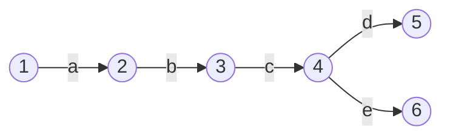


Now that we have a few features working, this is a good time to take a step back and build some things to help us see what we're working with. The tools we're going to build now will help with debugging as our features become more complex, and will give us a clearer picture of the logic of the systems we're working with.

As a side note, I also think it's worth mentioning that an important part of building a (kinda) sophisticated system is maintaining the developer infrastructure around it. That can be anything from tests, build tools, debugging tools - anything that helps you get your head around the system and manage that complexity.

So, let's build something to help us *see*.

### Visualizing Graphs

The issue we have is that it's not very easy to visualize a set of connected nodes (a graph) using variables and text. We *could* do it, and trace the pointer hashes from one object to the next, but it's not going to be very fun. As our system scales in complexity, this method will get more and more tedious.

As the old adage goes, a picture tells a thousand words...

We're going to produce something like this:


This visual representation of our FSM will give us a quick insight into whether we've compiled the regular expression correctly, and let us run through the steps ourselves to check when things go wrong.

This was created using `mermaid.js`.

### Mermaid.js for graphs

`mermaid.js` is a fantastic tool which allows us to write graphs in standard markdown which can be then rendered in the browser. The markdown for the above graph is the following;

```markdown
Graph LR
	1((1)) --a-->
	2((2)) --b-->
	3((3)) --c-->
	4((4)) --d--> 5((5))
	4((4)) --e--> 6((6))
```

Note: `mermaid` is much more powerful than this and has all sorts of wild and wonderful features. Check out [the docs](https://mermaid-js.github.io/mermaid) and see.

This is simple enough, we just need to parse our `States` and `Transitions` into the numbers and arrows in the markdown above.

As always, let's start with some tests to help define our objective.

```go
func TestState_Draw(t *testing.T) {  
   type test struct {  
      input, expected string  
   }  
  
   tests := []test{  
      {  
         input: "abc",  
         expected: `graph LR  
0((0)) --"a"--> 1((1))  
1((1)) --"b"--> 2((2))  
2((2)) --"c"--> 3((3))`,  
      },  
      {  
         input: "a b",  
         expected: `graph LR  
0((0)) --"a"--> 1((1))  
1((1)) --" "--> 2((2))  
2((2)) --"b"--> 3((3))`,  
      },  
   }  
  
   for _, tt := range tests {  
      t.Run(tt.input, func(t *testing.T) {  
         parser := NewParser()  
  
         tokens := lex(tt.input)  
         ast := parser.Parse(tokens)  
         fsm, _ := ast.compile()  
  
         drawing := fsm.Draw()  
  
         if drawing != tt.expected {  
            t.Fatalf("Expected drawing to be \n\"%s\", got\n\"%s\"", tt.expected, drawing)  
         }  
      })  
   }
```

This test is pretty straight forward, let's just zoom in on a couple of things.

```go
drawing := fsm.Draw()  
```

This is what we want to produce. It's a new method on the `State` struct, which will produce a `string` with the lines and numbers needed for our `mermaid` markdown.

```go
   tests := []test{  
      {  
         input: "abc",  
         expected: `graph LR  
0((0)) --"a"--> 1((1))  
1((1)) --"b"--> 2((2))  
2((2)) --"c"--> 3((3))`,  
      },  
      {  
         input: "a b",  
         expected: `graph LR  
0((0)) --"a"--> 1((1))  
1((1)) --" "--> 2((2))  
2((2)) --"b"--> 3((3))`,  
      },  
   }  
```

Here are our test cases. They're quite simple also, as they show simple cases of single character transition FSMs, and also a case for whitespaces.

Now that we have some red tests, we can start implementing the `Draw` method.

### Traversal

We need a line for every `Transition` in our FSM. Generically speaking, this means we need to look at every 'vertex' in our 'directed graph' (digraph). So, what we have here is a **graph traversal problem**. 

There are two generic ways to traverse a graph; Breadth-First Search (BFS) and Depth-First Search (DFS). How we visit every vertex will determine the order of the lines in our `mermaid` markdown. It doesn't make a huge difference, but DFS should lead to longer chains of connected nodes being drawn first. Another advantage of DFS is that our traversal algorithm can be defined recursively.

Our algorithm for collecting all the `Transitions` of the FSM should look something like this;

```go
// from the root node

1. If the current node has already been visited, stop.
2. Add the transitions from this node to a set of transitions.
3. Mark the current node as visited.
4. Recur on the destination node of every outgoing transition.
5. Recur on the source node of every incoming transition.
```

The order of the recursions is important here. We want to first collect the outgoing transitions of all the nodes, and then, starting from the last node and going backwards, collect the transitions of any unvisited nodes connected by incoming transitions.

I won't labor the point here, as it's tricky to visualize what's going on and distracts from what we're trying to do here. If this is mysterious to you, try walking step by step through the call stack and see where you end up.

We're going to build something to make this algorithm easier, a data structure to store the set of Transitions.

### The TransitionSet

This object has two **invariants** (qualities which never change).
1. All transitions in the set are unique.
2. The insertion order is maintained.

Let's code it.

```go
// TransitionSet maintains an ordered set of unique Transitionstype TransitionSet struct {  
   transitionSet  map[Transition]bool  
   transitionList []Transition  
}
```

We'll maintain two structures in parallel. The `map` will ensure that our `Transitions` are unique, and the `slice` will keep the insertion order.

We'll write two simple methods for checking if an element is present in the set, and another returning the ordered list of `Transitions`. We'll call these methods `has` and `list`.

```go 
func (ts *TransitionSet) has(t Transition) bool {  
   return ts.transitionSet[t]  
}  
  
func (ts *TransitionSet) list() []Transition {  
   return ts.transitionList[:]  
}
```

So far so good, all pretty simple. 

Adding to the set is just a case of adding the map and appending to the list. If the `Transition` is already in the set, we do nothing. This will be the `add` method.

```go
func (ts *TransitionSet) add(t Transition) {  
   if ts.transitionSet == nil {  
      ts.transitionSet = make(map[Transition]bool)  
   }  
     
   if !ts.transitionSet[t] {  
      ts.transitionSet[t] = true  
      ts.transitionList = append(ts.transitionList, t)  
   }  
}
```

Fantastic. We also need a similar data structure for keeping track of already 'visited' nodes, making sure we don't get caught in any circular loops. As we don't care about the insertion order here though, a simple `map[*State]bool` will be enough.

```go
// stateMap
sm := map[*State]bool

// has
hasState := sm[state]

// add 
sm[state]
```

Now we have all the pieces we need for our traversal algorithm.

### Writing the node traversal algorithm

Because of the useful data structures we've just dreamed up, writing the traversal algorithm maps pretty simply to the pseudocode we described earlier.

```go
func visitNodes(node *State, transitions *TransitionSet, visited map[*State]bool) {  
	// 1. If the current node has already been visited, stop.  
	if visited[node] {  
	   return  
	}  
	  
	// 2. Add the transitions from this node to a set of transitions.  
	for _, transition := range node.transitions {  
	   transitions.add(transition)  
	}  
	  
	// 3. Mark the current node as visited.  
	visited[node] = true  
	  
	// 4. Recur on the destination node of every outgoing transition.  
	for _, transition := range node.transitions {  
	   destinationNode := transition.to  
	   visitNodes(destinationNode, transitions, visited)  
	}  
	// 5. Recur on the source node of every incoming transition.  
	for _, sourceNode := range node.incoming {  
	   visitNodes(sourceNode, transitions, visited)  
	}
}
```

It's important that the `TransitionSet` and the `visited` map are passed by reference using pointers. They should be the same instance in every recursive call, as we want to collect `Transitions` and mark `Nodes` as visited across the whole graph.

Once we have collected the `Transitions`, we now just have to draw them as lines in our `mermaid` markdown.

```go

```