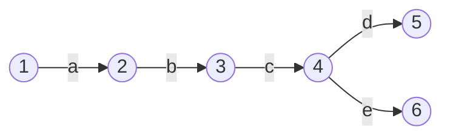


Now that we have a few features working, this is a good time to take a step back and build some things to help us see what we're working with. The tools we're going to build now will help with debugging as our features become more complex, and will give us a clearer picture of the logic of the systems we're working with.

As a side note, I also think it's worth mentioning that an important part of building a (kinda) sophisticated system is maintaining the developer infrastructure around it. That can be anything from tests, build tools, debugging tools - anything that helps you get your head around the system and manage that complexity.

So, let's build something to help us *see*.

### Visualizing Graphs

The issue we have is that it's not very easy to visualize a set of connected nodes (a graph) using variables and text. We *could* do it, and trace the pointer hashes from one object to the next, but it's not going to be very fun. As our system scales in complexity, this method will get more and more tedious.

As the old adage goes, a picture tells a thousand words...

We're going to produce something like this:


This visual representation of our FSM will give us a quick insight into whether we've compiled the regular expression correctly, and let us run through the steps ourselves to check when things go wrong.

This was created using `mermaid.js`.

### Mermaid.js for graphs

`mermaid.js` is a fantastic tool which allows us to write graphs in standard markdown which can be then rendered in the browser. The markdown for the above graph is the following;

```markdown
Graph LR
	1((1)) --a-->
	2((2)) --b-->
	3((3)) --c-->
	4((4)) --d--> 5((5))
	4((4)) --e--> 6((6))
```

Note: `mermaid` is much more powerful than this and has all sorts of wild and wonderful features. Check out [the docs](https://mermaid-js.github.io/mermaid) and see.

This is simple enough, we just need to parse our `States` and `Transitions` into the numbers and arrows in the markdown above.

As always, let's start with some tests to help define our objective.

```go
func TestState_Draw(t *testing.T) {  
   type test struct {  
      input, expected string  
   }  
  
   tests := []test{  
      {  
         input: "abc",  
         expected: `graph LR  
0((0)) --"a"--> 1((1))  
1((1)) --"b"--> 2((2))  
2((2)) --"c"--> 3((3))`,  
      },  
      {  
         input: "a b",  
         expected: `graph LR  
0((0)) --"a"--> 1((1))  
1((1)) --" "--> 2((2))  
2((2)) --"b"--> 3((3))`,  
      },  
   }  
  
   for _, tt := range tests {  
      t.Run(tt.input, func(t *testing.T) {  
         parser := NewParser()  
  
         tokens := lex(tt.input)  
         ast := parser.Parse(tokens)  
         fsm, _ := ast.compile()  
  
         drawing := fsm.Draw()  
  
         if drawing != tt.expected {  
            t.Fatalf("Expected drawing to be \n\"%s\", got\n\"%s\"", tt.expected, drawing)  
         }  
      })  
   }
```

This test is pretty straight forward, let's just zoom in on a couple of things.

```go
drawing := fsm.Draw()  
```

This is what we want to produce. It's a new method on the `State` struct, which will produce a `string` with the lines and numbers needed for our `mermaid` markdown.

```go
   tests := []test{  
      {  
         input: "abc",  
         expected: `graph LR  
0((0)) --"a"--> 1((1))  
1((1)) --"b"--> 2((2))  
2((2)) --"c"--> 3((3))`,  
      },  
      {  
         input: "a b",  
         expected: `graph LR  
0((0)) --"a"--> 1((1))  
1((1)) --" "--> 2((2))  
2((2)) --"b"--> 3((3))`,  
      },  
   }  
```

Here are our test cases. They're quite simple also, as they show simple cases of single character transition FSMs, and also a case for whitespaces.

Now that we have some red tests, we can start implementing the `Draw` method.

