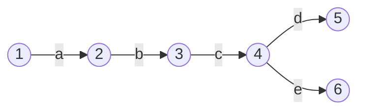
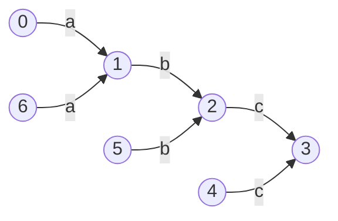
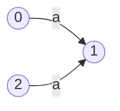
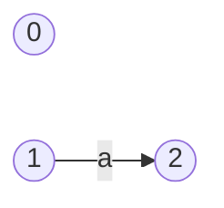
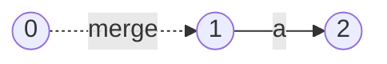
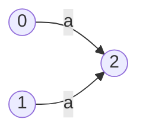
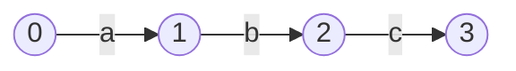


Now that we have a few features working, this is a good time to take a step back and build some things to help us see what we're working with. The tools we're going to build now will help with debugging as our features become more complex, and will give us a clearer picture of the logic of the systems we're working with.

As a side note, I also think it's worth mentioning that an important part of building a (kinda) sophisticated system is maintaining the developer infrastructure around it. That can be anything from tests, build tools, debugging tools - anything that helps you get your head around the system and manage that complexity.

So, let's build something to help us *see*.

### Visualizing Graphs

The issue we have is that it's not very easy to visualize a set of connected nodes (a graph) using variables and text. We *could* do it, and trace the pointer hashes from one object to the next, but it's not going to be very fun. As our system scales in complexity, this method will get more and more tedious.

As the old adage goes, a picture tells a thousand words...

We're going to produce something like this:


This visual representation of our FSM will give us a quick insight into whether we've compiled the regular expression correctly, and let us run through the steps ourselves to check when things go wrong.

This was created using `mermaid.js`.

### Mermaid.js for graphs

`mermaid.js` is a fantastic tool which allows us to write graphs in standard markdown which can be then rendered in the browser. The markdown for the above graph is the following;

```markdown
Graph LR
	1((1)) --a-->
	2((2)) --b-->
	3((3)) --c-->
	4((4)) --d--> 5((5))
	4((4)) --e--> 6((6))
```

Note: `mermaid` is much more powerful than this and has all sorts of wild and wonderful features. Check out [the docs](https://mermaid-js.github.io/mermaid) and see.

This is simple enough, we just need to parse our `States` and `Transitions` into the numbers and arrows in the markdown above.

As always, let's start with some tests to help define our objective.

```go
func TestState_Draw(t *testing.T) {  
   type test struct {  
      input, expected string  
   }  
  
   tests := []test{  
      {  
         input: "abc",  
         expected: `graph LR  
0((0)) --"a"--> 1((1))  
1((1)) --"b"--> 2((2))  
2((2)) --"c"--> 3((3))`,  
      },  
      {  
         input: "a b",  
         expected: `graph LR  
0((0)) --"a"--> 1((1))  
1((1)) --" "--> 2((2))  
2((2)) --"b"--> 3((3))`,  
      },  
   }  
  
   for _, tt := range tests {  
      t.Run(tt.input, func(t *testing.T) {  
         parser := NewParser()  
  
         tokens := lex(tt.input)  
         ast := parser.Parse(tokens)  
         fsm, _ := ast.compile()  
  
         drawing := fsm.Draw()  
  
         if drawing != tt.expected {  
            t.Fatalf("Expected drawing to be \n\"%s\", got\n\"%s\"", tt.expected, drawing)  
         }  
      })  
   }
```

This test is pretty straight forward, let's just zoom in on a couple of things.

```go
drawing := fsm.Draw()  
```

This is what we want to produce. It's a new method on the `State` struct, which will produce a `string` with the lines and numbers needed for our `mermaid` markdown.

```go
   tests := []test{  
      {  
         input: "abc",  
         expected: `graph LR  
0((0)) --"a"--> 1((1))  
1((1)) --"b"--> 2((2))  
2((2)) --"c"--> 3((3))`,  
      },  
      {  
         input: "a b",  
         expected: `graph LR  
0((0)) --"a"--> 1((1))  
1((1)) --" "--> 2((2))  
2((2)) --"b"--> 3((3))`,  
      },  
   }  
```

Here are our test cases. They're quite simple also, as they show simple cases of single character transition FSMs, and also a case for whitespaces.

Now that we have some red tests, we can start implementing the `Draw` method.

### Traversal

We need a line for every `Transition` in our FSM. Generically speaking, this means we need to look at every 'vertex' in our 'directed graph' (digraph). So, what we have here is a **graph traversal problem**. 

There are two generic ways to traverse a graph; Breadth-First Search (BFS) and Depth-First Search (DFS). How we visit every vertex will determine the order of the lines in our `mermaid` markdown. It doesn't make a huge difference, but DFS should lead to longer chains of connected nodes being drawn first. Another advantage of DFS is that our traversal algorithm can be defined recursively.

Our algorithm for collecting all the `Transitions` of the FSM should look something like this;

```go
// from the root node

1. If the current node has already been visited, stop.
2. Add the transitions from this node to a set of transitions.
3. Mark the current node as visited.
4. Recur on the destination node of every outgoing transition.
5. Recur on the source node of every incoming transition.
```

The order of the recursions is important here. We want to first collect the outgoing transitions of all the nodes, and then, starting from the last node and going backwards, collect the transitions of any unvisited nodes connected by incoming transitions.

I won't labor the point here, as it's tricky to visualize what's going on and distracts from what we're trying to do here. If this is mysterious to you, try walking step by step through the call stack and see where you end up.

We're going to build something to make this algorithm easier, a data structure to store the set of Transitions.

### The TransitionSet

This object has two **invariants** (qualities which never change).
1. All transitions in the set are unique.
2. The insertion order is maintained.

Let's code it.

```go
// TransitionSet maintains an ordered set of unique Transitions
type TransitionSet struct {  
   transitionSet  map[Transition]bool  
   transitionList []Transition  
}
```

We'll maintain two structures in parallel. The `map` will ensure that our `Transitions` are unique, and the `slice` will keep the insertion order.

We'll write two simple methods for checking if an element is present in the set, and another returning the ordered list of `Transitions`. We'll call these methods `has` and `list`.

```go 
func (ts *TransitionSet) has(t Transition) bool {  
   return ts.transitionSet[t]  
}  
  
func (ts *TransitionSet) list() []Transition {  
   return ts.transitionList[:]  
}
```

So far so good, all pretty simple. 

Adding to the set is just a case of adding the map and appending to the list. If the `Transition` is already in the set, we do nothing. This will be the `add` method.

```go
func (ts *TransitionSet) add(t Transition) {  
   if ts.transitionSet == nil {  
      ts.transitionSet = make(map[Transition]bool)  
   }  
     
   if !ts.transitionSet[t] {  
      ts.transitionSet[t] = true  
      ts.transitionList = append(ts.transitionList, t)  
   }  
}
```

Fantastic. We also need a similar data structure for keeping track of already 'visited' nodes, making sure we don't get caught in any circular loops. We also want to keep track of the order of visited nodes so that we can use that order as the number labels of the nodes.

What we actually want is a generic data structure which is a set which keeps the order of it's items. We'll call this an `OrderedSet`.

### Generics

We can use the new Generics features of Go 1.18 to write this generically and use the same structure for both 'visited' `*States` and `Transitions`.

Note: Notice that we want a set of `State` pointers, and a set of concrete `Transitions`. This is because `Transitions` contain all of their identifying information, such as their `to` and `from` states, and the predicate, as fields in the struct. `States`, on the other hand, require a reference to be identified.

Before we get into the generic implementation, we need to do some refactoring of `Transition` in order to make it `comparable` in Go (not a slice, map, or function type). This means that all of its fields must also be `comparable`, and currently the `predicate` field is a function type. Let's change that now.

```diff
- type Predicate func(input rune) bool
```

Instead, let's use a struct which can have either a string of allowed or disallowed chars[^generics].

[^generics]: This feels pretty clunky. I would have preferred a dynamic type which implements an interface, but interface fields on structs also have problems implementing the `comparable` interface. So far, generics are still tricky to make work in Go, but it's still early days.

```go
type Predicate struct {  
   allowedChars    string  
   disallowedChars string  
}  
  
func (p Predicate) test(input rune) bool {  
   if p.allowedChars != "" && p.disallowedChars != "" {  
      panic("must be mutually exclusive")  
   }  
  
   if len(p.allowedChars) > 0 {  
      return strings.ContainsRune(p.allowedChars, input)  
   }  
   if len(p.disallowedChars) > 0 {  
      return !strings.ContainsRune(p.disallowedChars, input)  
   }  
   return false  
}
```

And let's make a few changes so that our problem compiles.

```diff
 func (s *State) firstMatchingTransition(input rune) destination {
        for _, t := range s.transitions {
+               if t.predicate.test(input) {
-               if t.predicate(input) {
                        return t.to
                }
        }

	return nil
}

// ...

func (l CharacterLiteral) compile() (head *State, tail *State) {
        startingState := State{}
        endState := State{}
 
-       startingState.addTransition(&endState, func(input rune) bool { return input == l.Character }, string(l.Character))
+       startingState.addTransition(&endState, Predicate{allowedChars: string(l.Character)}, string(l.Character))
        return &startingState, &endState

// ...

func (w WildcardLiteral) compile() (head *State, tail *State) {  
   startingState := State{}  
   endState := State{}  
-  startingState.addTransition(&endState, func(input rune) bool { return input != "\n" }, string(l.Character))  
+  startingState.addTransition(&endState, Predicate{disallowedChars: "\n"}, ".")  
   return &startingState, &endState  
}

```

And now, let's change our `TransitionSet` to be a generic `OrderedSet` struct.

```diff
- type TransitionSet struct {  
-    transitionSet  map[Transition]bool  
-    transitionList []Transition  
- }
```
```go
// OrderedSet maintains an ordered set of unique items of type <T>
type OrderedSet[T comparable] struct {  
   set       map[T]int  
   nextIndex int  
}  
  
func (o *OrderedSet[T]) add(t T) {  
   if o.set == nil {  
      o.set = make(map[T]int)  
   }  
  
   if !o.has(t) {  
      o.set[t] = o.nextIndex  
      o.nextIndex++  
   }  
}  
  
func (o *OrderedSet[T]) has(t T) bool {  
   _, hasItem := o.set[t]  
   return hasItem  
}  
  
func (o *OrderedSet[T]) list() []T {  
   size := len(o.set)  
   list := make([]T, size)  
  
   for t, i := range o.set {  
      list[i] = t  
   }  
  
   return list  
}
```

We've changed the implementation here slightly by storing the index in the `set` field. This makes our `list` method a little more awkward, but it makes it easier to get the index of any item in the set, which will be useful for finding the numbers of our nodes.

```go
  
func (o *OrderedSet[T]) getIndex(t T) int {  
   return o.set[t]  
}
```

Now we have all the pieces we need for our traversal algorithm.

### Writing the node traversal algorithm

Because of the useful data structures we've just dreamed up, writing the traversal algorithm maps pretty simply to the pseudocode we described earlier.

```go
func visitNodes(  
   node *State,  
   transitions *OrderedSet[Transition],  
   visited *OrderedSet[*State],  
) {  
   // 1. If the current node has already been visited, stop.  
   if visited.has(node) {  
      return  
   }  
  
   // 2. Add the transitions from this node to a set of transitions.  
   for _, transition := range node.transitions {  
      transitions.add(transition)  
   }  
  
   // 3. Mark the current node as visited.  
   visited.add(node)  
  
   // 4. Recur on the destination node of every outgoing transition.  
   for _, transition := range node.transitions {  
      destinationNode := transition.to  
      visitNodes(destinationNode, transitions, visited)  
   }  
   // 5. Recur on the source node of every incoming transition.  
   for _, sourceNode := range node.incoming {  
      visitNodes(sourceNode, transitions, visited)  
   }  
}
```

It's important that the `transitions` and the `visited` `OrderedSets` are passed by reference using pointers. They should be the same instance in every recursive call, as we want to collect `Transitions` and mark `Nodes` as visited across the whole graph.

Once we have collected the `Transitions`, we now just have to draw them as lines in our `mermaid` markdown.

```go
func (s *State) Draw() string {  
   // initialize sets  
   transitionSet := OrderedSet[Transition]{}  
   nodeSet := OrderedSet[*State]{}  
  
   // collect transitions  
   visitNodes(s, &transitionSet, &nodeSet)  
  
   output := []string{  
      "graph LR",  
   }  
  
   // draw transitions  
   for _, t := range transitionSet.list() {  
      fromId := nodeSet.getIndex(t.from)  
      toId := nodeSet.getIndex(t.to)  
      output = append(output, fmt.Sprintf("%d((%d)) --\"%s\"--> %d((%d))", fromId, fromId, t.debugSymbol, toId, toId))  
   }  
   return strings.Join(output, "\n")  
}
```

Once all the hard work of collecting the `Nodes` and `Transitions` is done, it's quite simple to concatenate the strings required to build the `mermaid.js` code. I won't go into much more detail here, as the code seems to speak for itself.

With all this in place, let's run our tests.

```zsh
=== RUN   TestState_Draw
=== RUN   TestState_Draw/abc
    draw_test.go:38: Expected drawing to be 
        "graph LR
        0((0)) --"a"--> 1((1))
        1((1)) --"b"--> 2((2))
        2((2)) --"c"--> 3((3))", got
        "graph LR
        0((0)) --"a"--> 1((1))
        1((1)) --"b"--> 2((2))
        2((2)) --"c"--> 3((3))
        4((4)) --"c"--> 3((3))
        5((5)) --"b"--> 2((2))
        6((6)) --"a"--> 1((1))"
=== RUN   TestState_Draw/a_b
    draw_test.go:38: Expected drawing to be 
        "graph LR
        0((0)) --"a"--> 1((1))
        1((1)) --" "--> 2((2))
        2((2)) --"b"--> 3((3))", got
        "graph LR
        0((0)) --"a"--> 1((1))
        1((1)) --" "--> 2((2))
        2((2)) --"b"--> 3((3))
        4((4)) --"b"--> 3((3))
        5((5)) --" "--> 2((2))
        6((6)) --"a"--> 1((1))"
--- FAIL: TestState_Draw (0.00s)
    --- FAIL: TestState_Draw/abc (0.00s)

    --- FAIL: TestState_Draw/a_b (0.00s)
```

Hmm, interesting. Not quite what we were expecting. To see what's going on, let's plug the output graph of our `abc` test into [mermaids live coding site](https://mermaid.live/) and see what we're looking at.

```markdown
graph LR
        0((0)) --"a"--> 1((1))
        1((1)) --"b"--> 2((2))
        2((2)) --"c"--> 3((3))
        4((4)) --"c"--> 3((3))
        5((5)) --"b"--> 2((2))
        6((6)) --"a"--> 1((1))
```



That's certainly not right. We seem to have dangling `Nodes` which still have `Transitions` to intermediary nodes. This should not affect the accuracy of our regex engine, as `States` `4`, `5`, and `6` cannot be reached, but it does make our drawing a bit distracting.

The error here is in our `state.Merge` method.

```go
// adds the transitions of other State (s2) to this State (s).
//  
// warning: do not use if State s2 has any incoming transitions.  
func (s *State) merge(s2 *State) {  
   if len(s2.incoming) != 0 {  
      panic(fmt.Sprintf("State (%+v) cannot be merged if it has any incoming transitions. It has incoming transitions from the following states; %+v", *s2, s.incoming))  
   }  
  
   for _, t := range s2.transitions {  
      s.addTransition(t.to, t.predicate, t.debugSymbol)  
	}
}
```

Let's see this in a simpler example, the regex `a`.



Remember how the `compile` method of a `Group` node works? First we compile the `CharacterLiteral(a)` Node into a two-state FSM. We then create a new `State`, onto the tail of which we will merge all the children FSMs



In this simple example, there is one merge operation, during which we copy all the transitions from ` State 1` onto `State 0`. So...



Becomes...



The problem is that the transition from `1` to `2` remains, which leads to the dangling `State` `1` remaining in our drawing.

Let's remove those dangling transitions. When merging transitions, we want to;
1. copy the transitions from `State 1` to `State 0`
2. remove those transitions from `State 1`

```diff
// adds the transitions of other State (s2) to this State (s).//  
// warning: do not use if State s2 has any incoming transitions.  
func (s *State) merge(s2 *State) {  
   if len(s2.incoming) != 0 {  
      panic(fmt.Sprintf("State (%+v) cannot be merged if it has any incoming transitions. It has incoming transitions from the following states; %+v", *s2, s.incoming))  
   }  
  
   for _, t := range s2.transitions {  
+     // 1. copy s2 transitions to s
	  s.addTransition(t.to, t.predicate, t.debugSymbol)  
  
+     // 2. remove s2 transitions  
+     s2.removeTransition(t)
   }  
}  

+ func (s *State) removeTransition(target Transition) {  
+    newTransitions := []Transition{}  
+   
+    // 1. remove the target transition from s  
+    for _, transition := range s.transitions {  
+       if transition == target {  
+          newTransitions = append(newTransitions, transition)  
+       }  
+    }  
+    s.transitions = newTransitions  
+   
+    // 2. remove s from transition destination incoming states  
+    target.to.incoming = filterState(target.to.incoming, target.from)  
+ }
  
+ func filterState(states []*State, s2 *State) []*State {  
+    for i, state := range states {  
+       if s2 == state {  
+          return append(states[:i], states[i+1:]...)  
+       }  
+    }  
+    return states  
+ }
```

Now, running our tests should pass, and the output of our `abc` regex FSM should look correct.


Although nothing was strictly broken in our system, I hope that this demonstrates how useful it is to have tools like this for debugging a complex system.

### A quick command line tool

Let's add one more thing before we finish with our vizualizer. We want to be able to use it, quickly and easily, so let's make a command that we can run which takes a regular expression and shows us what the compiled FSM looks like.

Let's set up a `main` function[^2].

[^2]: I prefer some misdirection between the main function in order to strip away unnecessary command arguments. You might prefer to simply call `Draw` from the `main` package.

```go
package main

func main() {  
   switch os.Args[1] {  
   case "v5":  
      v5.Main(os.Args[2:])  
      return  
   }
}
```

```go
package v5

// Main just used for linking up the main functions
func Main(args []string) {  
   switch args[0] {  
   case "draw":  
      Draw(args[1])  
   default:  
      fmt.Println("command not recognized")  
   }  
}
```

With that, we can call `Draw` from our command. Let's test that things are set up correctly.

```go
func Draw(input string) {
	fmt.Println("Draw called with " + input)
}
```

We can run the program with `go run ./.. v5 draw {input}`.

```zsh
➜  search git:(master) ✗ go run ./... v5 draw "abc"

Draw called with abc
```

Great, now let's make `Draw()` open a browser and display our `mermaid` code.

```go
func Draw(input string) {  
   tokens := lex(input)  
   parser := NewParser()  
   ast := parser.Parse(tokens)  
   head, _ := ast.compile()  
  
   stateDrawing := head.Draw()  
  
   t, err := template.New("graph").Parse(`  
<script src="https://cdn.jsdelivr.net/npm/mermaid/dist/mermaid.min.js"></script>  
<script>mermaid.initialize({startOnLoad:true});  
</script>  
<div class="mermaid">  
    {{ . }}</div>  
<div>  
<span style="white-space: pre-wrap">{{ . }}</span>  
</div>  
`)  
   if err != nil {  
      panic(err)  
   }  
   w := bytes.Buffer{}  
   err = t.Execute(&w, stateDrawing)  
   if err != nil {  
      return  
   }  
  
   reader := strings.NewReader(w.String())  
   err = browser.OpenReader(reader)  
   if err != nil {  
      panic(err)  
   }  
   return  
}
```

Let's try that again. It should now open a browser with a visualization of your compiled FSM! This is going to come in very handy as our program grows in complexity.

That's enough for visualizations for now, we can now move onto adding new features to our regex engine.