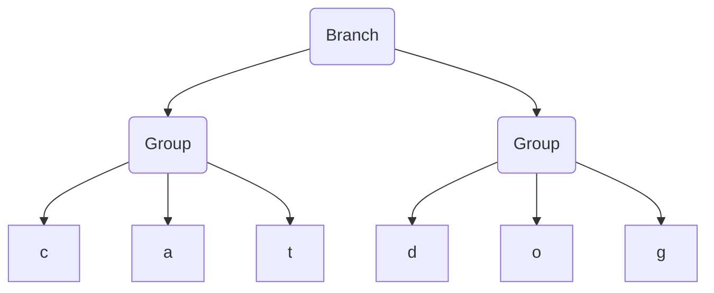
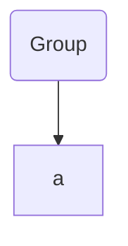
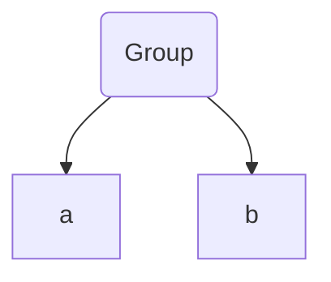
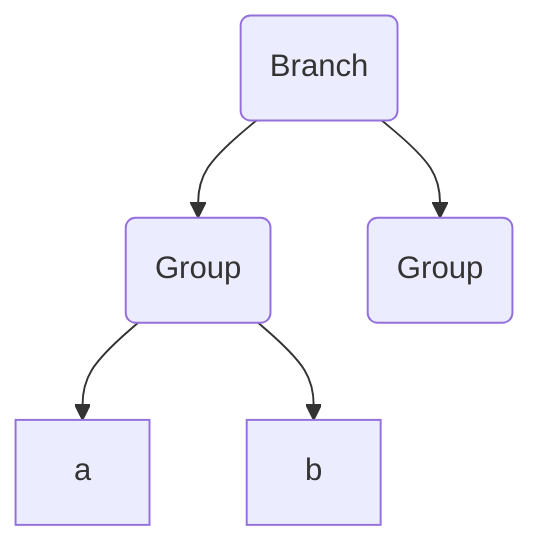
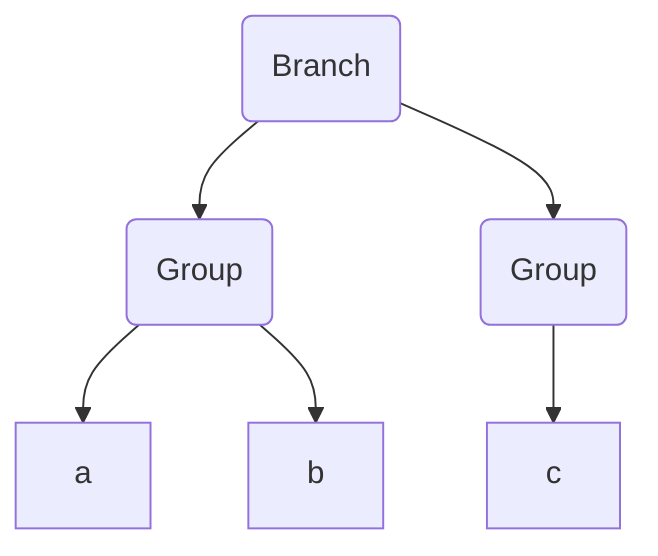
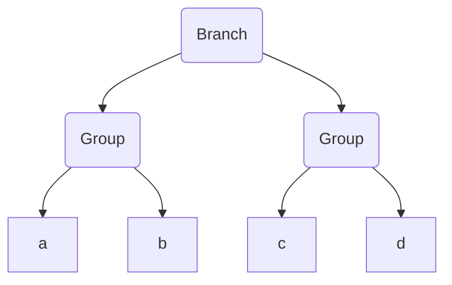
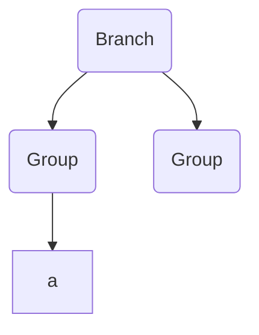
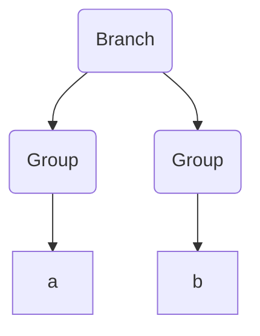
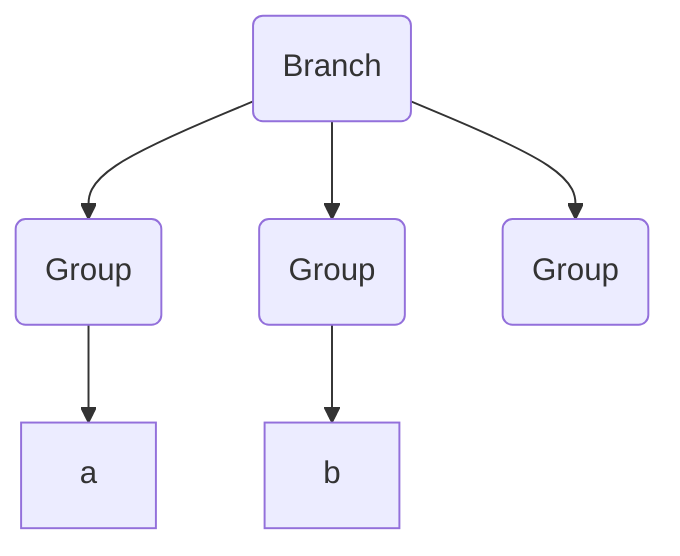
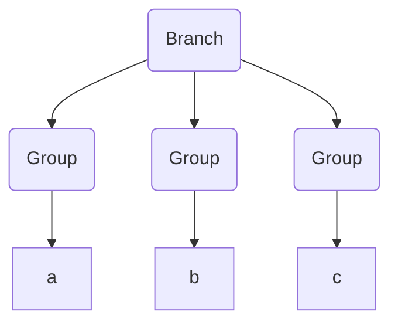


## The OR expression

It's very useful to use a regular expression to match against multiple different possible substrings. For example, to check that a file is an image type, you might use the regular expression `"png|jpge|gif"` on the file extension. This would tell you if the file was `png` OR `jpeg` OR `gif`. The options of the OR expression are determined by the separating them with a `pipe` symbol (`"|"`). 

Let's have a look at what an FSM would look like with OR expressions. Take the regular expression `"dog|cat"` as an example.


As we can see, it looks similar to our previous examples, with the notable difference that our starting state has multiple outward `Transitions`. In this case, it can transition on both the `'d'` and the `'c'` characters. 

Let's step through this using the string `"cat"` as our input search string.


First, we process the character `'c'`, which matches the bottom transition.


Then, we process `'a'`


And finally `'t'`, which leaves us in an end state.


Pretty simple stuff! Now that we know what we're looking for, let's start coding.

We'll start at the `Parser`.

## Parsing pipes in branches

We're going to want to be able to represent branches as `AST` nodes, so our parser needs to know how to take a regular expression such as `cat|dog` and turn it into a `Branch` AST node with two `Group` child nodes, each containing three `CharacterLiteral` nodes. Visually, the `cat|dog` example should look like this:



Let's start by adding a test to our `parser_test.go` file.

```diff
@@ // parser_test.go

@@ func TestParser(t *testing.T) {
+               {name: "branches", input: "ab|cd|ef", expectedResult: &Branch{ChildNodes: []Node{
+                       &Group{ChildNodes: []Node{
+                               CharacterLiteral{Character: 'a'},
+                               CharacterLiteral{Character: 'b'},
+                       }},
+                       &Group{ChildNodes: []Node{
+                               CharacterLiteral{Character: 'c'},
+                               CharacterLiteral{Character: 'd'},
+                       }},
+                       &Group{ChildNodes: []Node{
+                               CharacterLiteral{Character: 'e'},
+                               CharacterLiteral{Character: 'f'},
+                       }},
+               }}},
        }

```

Let's run those tests and see what we're working with. We get the following error message.

```zsh
Expected [&{ChildNodes:[0x1400000c0d8 0x1400000c0f0 0x1400000c108]}], got [&{ChildNodes:[{Character:97} {Character:98} {Character:99} {Character:100 {Character:101} {Character:102}]}]
```

Hmm, not very helpful. The problem is that displaying hierarchical data structures is not something that Go does very well on it's own. In this case, it's just printing our pointers. We want something more like the tests we've just written - the indentation at each level makes it obvious which `Nodes` are child nodes and which are parent `Nodes`. Let's take another quick detour and improve how we print out our AST `Nodes`.

## Debug printing AST Nodes

We want each level in the hierarchy to be indented a bit more than the previous level, so that we end up with something like this:

```zsh
level 1
  level 2
    level 3
  level 2 
  level 2
level 1
```

We can do this by telling each node which level it is at, and having it print an indentation with the length of that level before it prints the description of the `Node`. Let's start with the leaf nodes, as they're the easiest.

```go
// ast.go

func (l CharacterLiteral) string(indentation int) string {  
   padding := strings.Repeat("--", indentation)  
   return fmt.Sprintf("%sCharacterLiteral('%s')", padding, string(l.Character))  
}  
  
func (w WildcardLiteral) string(indentation int) string {  
   padding := strings.Repeat("--", indentation)  
   return fmt.Sprintf("%sWildcardCharacterLiteral", padding)  
}
```

Now, the `CompositeNodes`, which for now is only `Group`, will also need to print it's description with an indentation. The trick here is to also *ask all of it's child nodes to print with the indentation + 1*.

```go
// ast.go

func (g *Group) string(indentation int) string {  
   return compositeToString("Group", g.ChildNodes, indentation)  
}  
  
func compositeToString(title string, children []Node, indentation int) string {  
   padding := strings.Repeat("--", indentation)  
   res := padding + title  
   for _, node := range children {  
      res += fmt.Sprintf("\n%s%s", padding, node.string(indentation+1))  
   }  
   return res  
}
```

We'll also need to tell Go that every node can print using the `string(indentation int)` method, so let's add it to the `Node` interface.

```diff
@@ // ast.go

 type Node interface {
        compile() (head *State, tail *State)
+       string(indentation int) string
 }
```

And finally call these methods from the composite Nodes `String()` method so that our tests use it for output.

```go
  
func (g *Group) String() string {  
   return "\n" + g.string(0)  
}
```

Now, let's take a look at our error message again.

```zsh
=== RUN   TestParser/branches
    parser_test.go:53: Expected [
        Branch
        --Group
        ------CharacterLiteral('a')
        ------CharacterLiteral('b')
        --Group
        ------CharacterLiteral('c')
        ------CharacterLiteral('d')
        --Group
        ------CharacterLiteral('e')
        ------CharacterLiteral('f')], got [
        Group
        --CharacterLiteral('a')
        --CharacterLiteral('b')
        --CharacterLiteral('c')
        --CharacterLiteral('d')
        --CharacterLiteral('e')
        --CharacterLiteral('f')]
```

That's better, we can now immediately see what's going on.

{}
It probably seems like we're spending a lot of time building things to help us visualize our system, rather than building the system itself. That's true, and this is a large investment. However, this should pay dividends when it comes to debugging issues that come up, and in simply understanding our system better. 

It's hard to give hard numbers when it comes to deciding whether a tool is worth the time it takes to build it, but considering that the implementation is fairly straight forward, I think it's easily worth it in this case.
{}

So let's fix our parser.

## Adding Pipes to our Parser

During the parsing of a string of tokens, if we come across the `Pipe` ( `'|'`) token, we want to do one of two things, depending on whether the top `Node` in the stack is a `Branch` node or not.

1. If the top `Node` of the stack is **not** a `Branch` node, want to replace the top of the stack with a new `Branch` node, which will contain the top stack node as its first child, and a new `Group` as its second child.
2. If the top `Node` of the stack is a `Branch` node, we want to 'split' the `Branch` node, which basically means adding a fresh `Group` node as another child of the `Branch` node.

Let's walk through these in more detail.

### 1. Creating a new Branch node

let's parse the regex `"ab|cd"`.

First, the letter `'a'`.


Then `'b'`,

Now we have our pipe character `'|'`. With this, we should create a new `Branch` node and place our `Group` node as it's first child. We should also create a new `Group` node and it should be a new child of the `Branch` node.

Continuing, we have `'c'`. We should now be appending new expressions to the newly created group (the second child of the `Branch` node).

And finally, `'d'`. The `AST` parsing is now complete.


### 2. Splitting a branch

Let's try parsing the regex `a|b|c`.

First, we parse the `'a'` character.

Now, our first `'|'` token. This uses the first option, where a new `Branch` is created.

Next, an `'b'` character token. This will be appended to the latest child of `Branch`.


And now, our second `'|'` token. As the top of the stack will now be pointing to a `Branch` node, we will 'split' this branch and create a new child.


And finally, the `'c'` character will be appended to the newly created group.


## Coding the Pipe Parser

The changes necessary for this are actually quite small. We simply need to add our `Branch` node and a new case in the parsers main `switch` statement.

First, our `Branch` node.

```go 
// ast.go

type Branch struct {  
   ChildNodes []Node  
}

func (b *Branch) Append(node Node) {  
   for i := len(b.ChildNodes) - 1; i > 0; i-- {  
      switch n := b.ChildNodes[i].(type) {  
      case CompositeNode:  
         n.Append(node)  
         return  
      }  
   }  
  
   panic("should have at least one composite node child")  
}

func (b *Branch) compile() (head *State, tail *State) {  
	panic("implement me")
}
```

The `Append` method here is interesting. We want to append to the latest child of the `Branch`, so we iterate backwards through the `ChildNodes`. We also expect that we will always have at least one `CompositeNode` child, so we should panic otherwise.

Also, we add a stand-in `compile` function to get the compiler to stop complaining.

We also need a way to 'split' the branch. This simply means adding a new child with an empty `Group` node.

```go
// ast.go

func (b *Branch) Split() {  
   b.ChildNodes = append(b.ChildNodes, &Group{})  
}
```

And then, in our parser, we add a case for processing `Pipe` tokens.

```diff
@@ // parser.go
		 	for _, t := range tokens {  
			    switch t.symbol {  
			    case Character:  
			 	   node := p.pop()  
				   node.Append(CharacterLiteral{Character: t.letter})  
				   p.push(node)  
			    case AnyCharacter:  
				   node := p.pop()  
				   node.Append(WildcardLiteral{})  
				   p.push(node)
+               case Pipe:
+                       node := p.pop()
+                       switch b := node.(type) {
+                       case *Branch:
+                               b.Split()
+                       default:
+                               node = &Branch{ChildNodes: []Node{node, &Group{}}}
+                       }
+                       p.push(node)
                }

```

This should be enough to get our `Parser` tests green again. Next, we need to compile this AST node into an FSM.

## Compiling a Branch node

We want to take our AST and create a valid FSM from it. This will be enough to make our implementation work, so let's start with a test before we implement anything.

```diff
@@ // fsm_test.go

@@ func TestFSMAgainstGoRegexPkg(t *testing.T) {
                {"wildcard regex matching", "ab.", "abc"},
                {"wildcard regex not matching", "ab.", "ab"},
                {"wildcards matching newlines", "..0", "0\n0"},
+
+               // branch
+               {"branch matching 1st branch", "ab|cd", "ab"},
+               {"branch matching 2nd branch", "ab|cd", "cd"},
+               {"branch not matching", "ab|cd", "ac"},
        }

```

These should be failing as we simply panic when we try to compile any `Branch` AST `Nodes`. Let's fix this.

Going from this:


To this:


Is not too difficult. They already share a lot of the same characteristics because the shape is so similar. As I've stressed in earlier chapters, parsing the structure first and then compiling the end result separately is a fantastic way to reduce the overall complexity of this operation.

For now, we can use the following algorithm for parsing a `Branch` node:

1. Create a starting `State`.
2. Compile each child node, and merge the first `State` of each child with the starting `State`.

This has some issues, as we'll see later, but for now this will work. Let's put it into code.

```go
// ast.go 

func (b *Branch) compile() (head *State, tail *State) {  
	// 1. Create a starting State.
	startState := &State{}  
	
	// 2. Compile each child node, and merge the first State of each child with the starting State.
	for _, expression := range b.ChildNodes {  
		nextStateHead, _ := expression.compile()  
		startState.merge(nextStateHead)  
	}  
	return startState, startState  
}
```

That should be enough to successfully compile a `Branch` node. Our tests should now be green, so let's see what we've created by using our visualizer tools.

Let's see what happens when we run the `draw "ab|cd|ef" "aaccef"` command. We should get something like the following in the browser.


Looks great! Our FSM looks exactly as we'd expect, and our algorithm (after quite a bit of backtracking) eventually finds the correct match. 

There is one deep dark problem here though which we've been conveniently ignoring, and it goes right to the heart of finite state machines.

## Deterministic vs Non Deterministic State Machines

