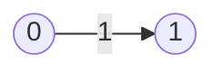
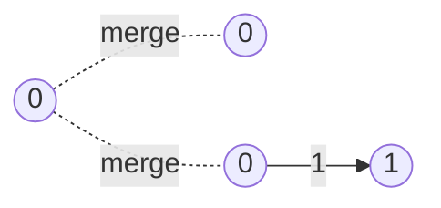
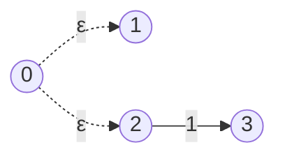
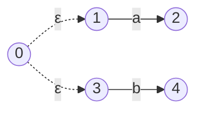
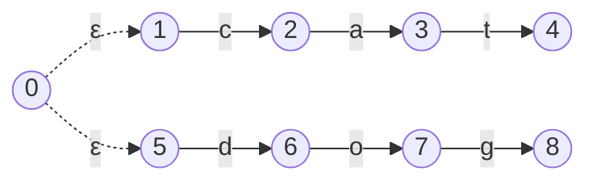
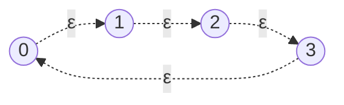
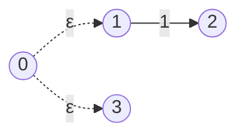

## The empty string

So, we have a regex engine that can handle branches, but our handy fuzzer has found something we can't process correctly; The regular expression `'1|'`.

This is the same as saying "match the regex `'1'` OR match the regex `''`", but what does it mean to match the regex `''`? This is the empty string case, and it's something we're going to start dealing with. 

Semantically, the regular expression `''` should always match, because every string, including the empty string itself, contains within it the empty string. Also, any string of N characters contains N+1 empty strings within it, because each character has an empty string on either side of it. For example, the string `"ab"` has an empty string before `a`, between `a` and `b`, and after `b` (like `'_a_b_'` where `'_'` represents an empty string).

Up until now, the empty string hasn't posed us a problem because we've only dealt with concatenations. The empty string can only appear as the regular expression `''`, which would lead to the following FSM:


Which would automatically be in a success state. Remember, **a success state in our program is defined as any state with no outgoing transitions**. As this single `State` has no other transitions, it would be considered a `success`, and so a match would always be found.

But now, we need a way of dealing with empty string expressions of different branches, such as in our current problem of `1|`. Currently, our compiler produces the FSM


Which is the result of the following merge operations:



This effectively removes the top expression, our empty string expression. It seems that in cases such as these, the merge operation will not work. What we want is a way of *starting at each branch at the same time*, rather than starting from the same place. 

The difference is subtle but critical, and we can't do this with our current FSM. We'll need to introduce a new and powerful element to our FSM. The **epsilon (ε) transition**.

## ε

In the context of Finite State Machines, the ε, or epsilon, represents the empty string. If a state has a transition on the condition of the empty string, it means that it doesn't need to process a character in order to transition to the next state. This turns out to be a very powerful characteristic for composing FSMs representing complex regular expressions.

One thing that we can do with epsilon transitions is to say "If you're in this state, you should also be in these other states". This makes it easier to compose FSMs because we can take subtrees of the FSM - decoupled groups of `States` which represent a subset - and join them together using epsilons without worrying about how they start. 

For example, the above `'|1'` regular expression can be represented using epsilon transitions as the following FSM.



These epsilon transitions mean that starting at `State 0` is **equivalent** to starting at `State 1` and `State 2`.

### Implementing epsilon transitions

We need to treat epsilon transitions differently to regular transitions. It will require some changes to how we process characters, because we'll need to process the epsilon transitions before and after the character transitions. 

We can break the implementation down into a few steps

1. Add epsilon transitions to data structures
2. Compile using epsilon transitions
3. Draw epsilon transitions
4. Process epsilon transitions

Before any of that, however, let's start with a test case for the problem we're trying to solve. In this case, it's the `'1|'` case, so let's start with something similar.

```diff
@@ // fsm_test.go
@@ func TestFSMAgainstGoRegexPkg(t *testing.T) {

                {"branch matching 1st branch", "ab|cd", "ab"},
                {"branch matching 2nd branch", "ab|cd", "cd"},
                {"branch not matching", "ab|cd", "ac"},
                {"branch with shared characters", "dog|dot", "dog"}, 
                {"branch with shared characters", "dog|dot", "dot"}, 
+               {"branch with right side empty", "a|", ""},
+               {"branch with left side empty", "|a", ""},
        }
```

Now, let's start including them in our main data structures.

### 1. Add epsilons to data structures

```diff
@@ // state.go

 type State struct {
        transitions []Transition
+       epsilons    []*State
        incoming    []*State
 }
```

Epsilon transitions don't need things like `Predicates` like regular transitions do, because they always result in a transition. Because of this, we can represent them simply as a slice of `State` pointers.

We'll also need to change the success criteria of a state to include epsilons.

```diff
@@ // state.go

 func (s *State) isSuccessState() bool {
-       if len(s.transitions) == 0 {
+       if len(s.transitions) == 0 && len(s.epsilons) == 0 {
                return true
        }
```
 
 Epsilons should be deleted when removing a node also.

```diff
@@ // state.go

func (s *State) delete() {  
   // 1. remove s from incoming of connected nodes.  
   for _, t := range s.transitions {  
      t.to.removeIncoming(s)  
   }  
  
   // 2. remove the outgoing transitions  
   s.transitions = nil  
+  s.epsilons = nil  
}
```
 
 And let's include a method to add new epsilon transitions, similar to how we add regular transitions.

```go 
// state.go

func (s *State) addEpsilon(destination *State) {  
   s.epsilons = append(s.epsilons, destination)  
   destination.incoming = append(destination.incoming, s)  
}
```

That should be enough for our data structures, let's move onto compiling our AST nodes into FSMs that use epsilon transitions.

### 2. Compiling with epsilon transitions.

For branches, the changes required to use epsilon transitions are very small. We want to change this;


To this;


So we simply need to swap out the `merge` operations for `addEpsilon` operations.

```diff
@@ // ast.go

func (b *Branch) compile() (head *State, tail *State) {
        startState := &State{}
        for _, expression := range b.ChildNodes {
                nextStateHead, _ := expression.compile()
-               startState.merge(nextStateHead)
+               startState.addEpsilon(nextStateHead)
        }
        return startState, startState
 }
```

That's really all there is to the compilation step.

It's a shame that we can't verify it yet, so let's now fix our `draw` functions so that we can visualize our new epsilon transitions.

### 3. Drawing epsilon transitions

Let's start with adding a new test case to our `Test_drawFSM` test function which uses a branch regex. This will let us define what we want our `mermaid` graph to look like for FSMs with epsilon transitions.

```diff
@@ // draw_test.go

@@ func Test_DrawFSM(t *testing.T) {

+               {
+                       name:  "branch with epsilon",
+                       regex: "a|b",
+                       expected: `graph LR
+0((0)) -."ε".-> 1((1))
+0((0)) -."ε".-> 3((3))
+1((1)) --"a"--> 2((2))
+3((3)) --"b"--> 4((4))`,
+               },

```

This would render the following `mermaid` graph.



This looks great, the epsilon transitions are denoted with dotted lines and a `'ε'` symbol. It's also notable that the epsilon lines are drawn before the transition lines. This is not relevant now, but might have an effect later on when we have arrows going in different directions.

Ok, let's change our `draw` code to reflect these changes and get our tests to green again. First, we'll need to adapt our `visitNodes` function to add epsilon transitions to our `OrderedSet[Transition]` *before* we add regular transitions, and we'll also want to recur on epsilon transitions as well as regular transitions to make sure that every connected node is visited.

```diff
@@ // draw.go

@@ -37,7 +41,16 @@ func visitNodes(
                return
        }
 
+       // 2.i. Add transitions for the nodes epsilon transitions
+       for _, epsilon := range node.epsilons {
+               transitions.add(Transition{
+                       debugSymbol: "ε",
+                       from:        node,
+                       to:          epsilon,
+                       predicate:   Predicate{},
+               })
+       }
        // 2 Add the transitions from this node to a set of transitions.
        for _, transition := range node.transitions {
                transitions.add(transition)
        }
@@ -45,6 +58,10 @@ func visitNodes(
        // 3. Mark the current node as visited.
        visited.add(node)
 
+       // 4.i. Recur on every epsilon.
+       for _, epsilon := range node.epsilons {
+               visitNodes(epsilon, transitions, visited)
+       }
        // 4. Recur on the destination node of every outgoing transition.
        for _, transition := range node.transitions {
                destinationNode := transition.to

```

Nearly there, we just need to draw epsilons with dotted lines instead of regular lines.

```diff
@@ // draw.go

@@ func (s *State) Draw() (graph string, nodeSet OrderedSet[*State]) {
        for _, t := range transitionSet.list() {
                fromId := nodeSet.getIndex(t.from)
                toId := nodeSet.getIndex(t.to)
-               output = append(output, fmt.Sprintf("%d((%d)) --\"%s\"--> %d((%d))", fromId, fromId, t.debugSymbol, toId, toId))
+               if t.debugSymbol == "ε" {
+                       output = append(output, fmt.Sprintf("%d((%d)) -.\"%s\".-> %d((%d))", fromId, fromId, t.debugSymbol, toId, toId))
+               } else {
+                       output = append(output, fmt.Sprintf("%d((%d)) --\"%s\"--> %d((%d))", fromId, fromId, t.debugSymbol, toId, toId))
+               }
        }
```

Now, our `draw` tests should be passing, and we can print out the graph below for the regular expression `cat|dog`.



Great! Let's also look at the FSM we create for our problematic `'|1'` case:


That's better. Now, before we've processed any character, we should already be in `State 0`, `State 1` and `State 2`. `State 1` represents an FSM for an empty string, and, as we can see, it has no outgoing transitions, so it always has a `success` status.

The only thing left to get this working is to actually process the epsilon transitions in our `runner`.

### 4. Processing epsilon transitions

Before we think about how to process epsilon transitions, let's think about where and when we need to process them. We'll imagine for now that we have a `advanceEpsilons` function that we can call, and we'll figure out how it works later[^des].
[^des]: This is a handy design practice that can be used in many situations. Come up with the name of a function first, use it as you would like to, and only then come up with the implementation. Like TTD, it forces you to think first about the purpose of the function, before thinking about how it works.

Epsilons need to be processed before any characters have been processed. Let's account for this in our `Next` function, as well as our `Start` and `Reset` functions.

```diff
@@ // runner.go

@@ func (r *runner) Next(input rune) {
 
+       r.advanceEpsilons()
+
        nextActiveStates := Set[*State]{}
        for activeState := range r.activeStates {
                for _, nextState := range activeState.matchingTransitions(input) {
@@ -26,6 +28,8 @@ func (r *runner) Next(input rune) {
                }
        }
        r.activeStates = nextActiveStates
 }

 func (r *runner) Reset() {
        r.activeStates = NewSet[*State](r.head)
+       r.advanceEpsilons()
 }
 
 func (r *runner) Start() {
        r.activeStates.add(r.head)
+       r.advanceEpsilons()
+}
```

This should cover most of our cases, but there's one more thing we've not thought about yet. What happens if we process a character and land on a new `State` which has outgoing epsilon transitions? We would need to activate the `States` pointed to by those epsilon transitions also, so let's call `advanceEpsilons` after processing the character transitions also.

```diff
@@ // runner.go

@@ func (r *runner) Next(input rune) {

+       r.advanceEpsilons()
+
        nextActiveStates := Set[*State]{}
        for activeState := range r.activeStates {
                for _, nextState := range activeState.matchingTransitions(input) {
@@ -26,6 +28,8 @@ func (r *runner) Next(input rune) {
                }
        }
        r.activeStates = nextActiveStates
+
+       r.advanceEpsilons()
 }
```

Ok, let's now look at `advanceEpsilons`. The algorithm for this function should be fairly simple, but could have significant performance implications. The reason for this is that it is recursive in nature. To understand this, imagine an FSM of which every node is connected by an epsilon transition.


This is a perfectly valid FSM, and we need to be able to process it. What would happen is that we would start from `State 0`, process its epsilon transition to activate `State 1`, and then we would need to *recursively activate* the epsilon transitions of `State 2`, and so on until all epsilon transitions have been processed for all active states. We also need to be careful when we get to `State 3`, because `State 0` has already been activated, so we want to stop the recursion there. If we don't stop, we could end up in an infinite loop.

```go
// runner.go

func (r *runner) advanceEpsilons() {  
   for state := range r.activeStates {  
      r.activateConnectedEpsilons(state)  
   }  
}  
  
func (r *runner) activateConnectedEpsilons(state *State) {  
   for _, epsilon := range state.epsilons {  
      if !r.activeStates.has(epsilon) {  
         r.activeStates.add(epsilon)  
         r.activateConnectedEpsilons(state)  
      }  
   }  
}
```

In the algorithm above, we look at each active `State`, look at each of that `State's` epsilons, and see if it's already active. Only if it's not active do we add it to the `activeStates` set, and then recur on that `State`. Otherwise, it's just ignored.

That should be enough to get our tests working again. Let's check out a few examples in our visualizer to get a sense of what's happening.

Let's try our `cat|dog` example. First we'll try the input string `"cat"`


Great, we now start in `State 1` and `State 5` because of our epsilon transitions. Now with the input string `"dog"`.


Great, everything's still working perfectly. 

What about one of the failing example we had before? Previously, branches which shared substrings were having difficulty because the FSM didn't determine which branch it should go down. We fixed this before with multiple active states, let's make sure that it's still working.


Great, still as expected.

What about our tricky `'1|'` regular expression? Let's try that now.


As we can see, our FSM is always in a `success` state; `State 3`. Great, it looks like we've covered all the cases for branches. Let's run our fuzzer and see if we're right.

Not quite, the fuzzer finds an error pretty quickly...

```zsh
--- FAIL: FuzzFSM (0.00s)
	fsm_test.go:142: Mismatch - 
		Regex: '1(|)' (as bytes: 31287c29), 
		Input: '0' (as bytes: 30) 
		-> 
		Go Regex Pkg: 'false', 
		Our regex result: 'true'
```

Let's break down the regex `1(|)`. It's looking for the character `'1'` followed by `''` OR `''`. In other words, it's looking for the character `'1'`. Given that information, it's obvious that we shouldn't give a correct match with `0`! Let's inspect our FSM graph to see what's going on.



Ok, we can see the problem here. This FSM does not respect the `'('` and `')'` characters in the regular expression, and is instead compiling the regular expression `1|`. This is not surprising, as haven't taught our program how to handle parentheses yet! 

{} 
It's worth noting that we haven't run into any issues with parentheses until now because, until now, we've only been working with concatenations. Concatenation has the **associative property**, which means that we can group them together without it making a difference to the outcome. For example, `"a" + "b" + "c"` is the same as `"a" + ("b" + "c")`. 
Integer addition is also associate, so `1 + 2 + 3 == 1 + (2 + 3)`. 
{}

Now's the time to add support for grouping by parentheses.

{} 
Check out this part of the project on GitHub [here](https://github.com/LeweyM/search/tree/master/src/v7)
{} 