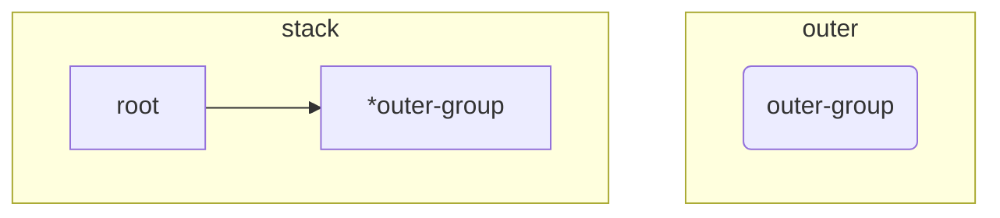
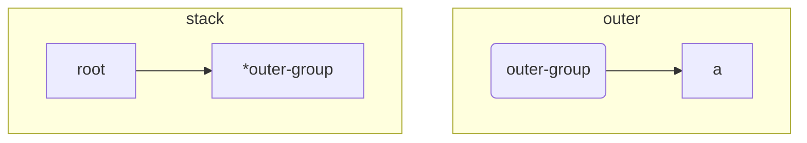
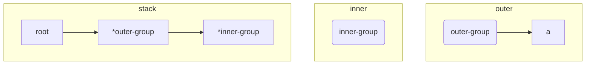
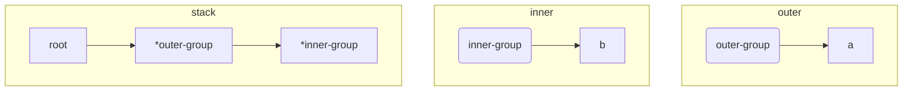
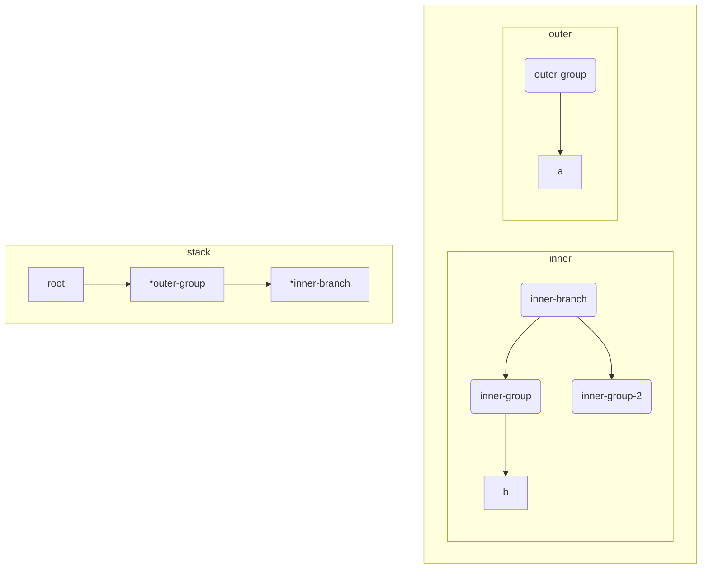
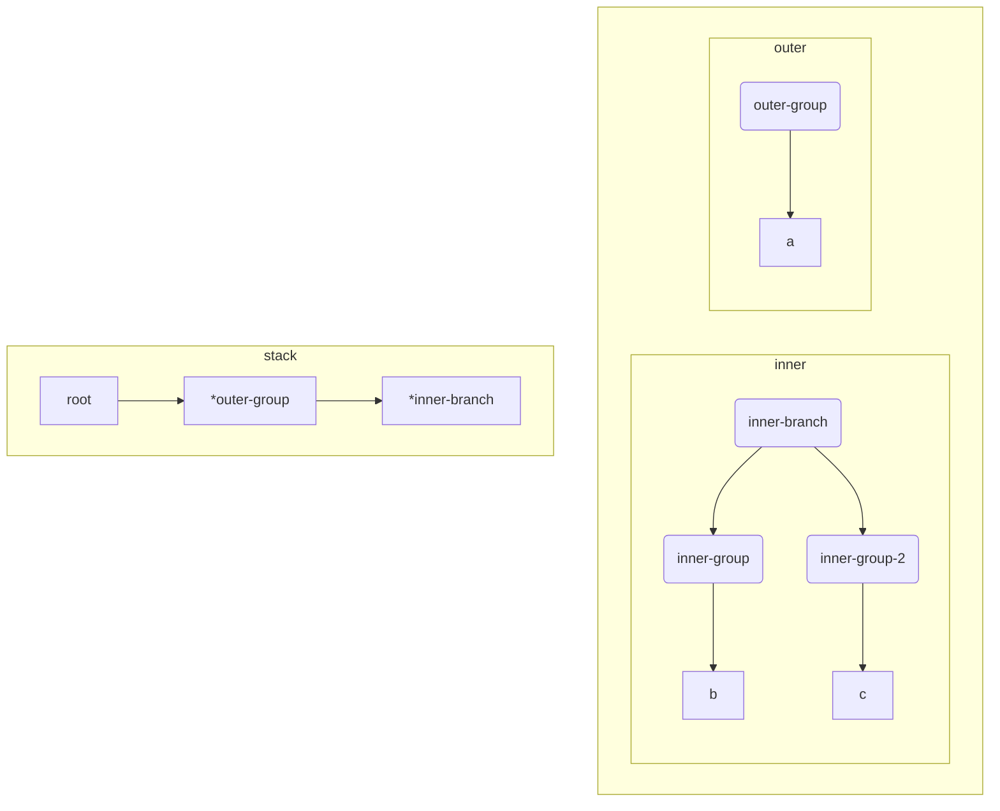
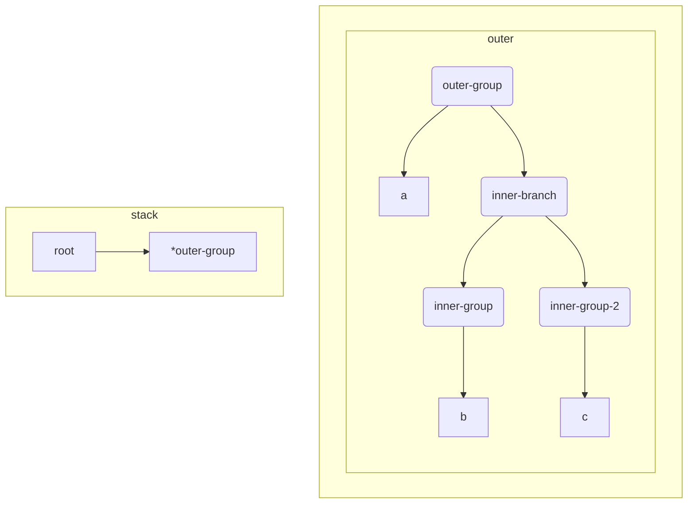

## Groups

Regular expressions can be grouped together using the `'()'` parenthesis symbols, in the same way that arithmetic constructions such as `(1 + (3 * 7))` can be grouped. This hasn't been a problem yet because up until now, we've only dealt with concatenation, and string concatenation is an associative operation. This means that grouping doesn't make a difference. For example, `'a' + 'b' + 'c' == 'a' + 'bc' == 'ab' + 'c' == 'abc'`.

However, our `OR '|'` operation is non-associative. For example, the following regular expressions are not equivalent: `ab|c != a(b|c)`.

This is the reason for the fuzzing error we're seeing.

```zsh
--- FAIL: FuzzFSM (0.00s)
	fsm_test.go:142: Mismatch - 
		Regex: '1(|)' (as bytes: 31287c29), 
		Input: '0' (as bytes: 30) 
		-> 
		Go Regex Pkg: 'false', 
		Our regex result: 'true'
```

Our regex compiler is interpreting `1(|)` as `1|`, which produce very different outcomes. Let's add a test to represent this case.

```diff
@@ // fsm_test.go

@@ func TestFSMAgainstGoRegexPkg(t *testing.T) {
                {"branch with shared characters", "dog|dot", "dot"},
                {"branch with right side empty", "a|", ""},
                {"branch with left side empty", "|a", ""},
+
+               // group
+               {"word followed by group", "1(|)", "0"},

```

Now let's fix this by taking into account the `()` symbols and breaking the regular expression into groups, starting with the parser.

## Parsing groups

Let's add a test to our parser to define what we want to produce.

```diff
@@ // parser_test.go

@@ func TestParser(t *testing.T) {
+               {name: "groups", input: "a(b|c)", expectedResult: &Group{ChildNodes: []Node{
+                       CharacterLiteral{Character: 'a'},
+                       &Branch{ChildNodes: []Node{
+                               &Group{ChildNodes: []Node{
+                                       CharacterLiteral{Character: 'b'},
+                               }},
+                               &Group{ChildNodes: []Node{
+                                       CharacterLiteral{Character: 'c'},
+                               }},
+                       }},
+               }}},
        }

```

This should be failing. We can see from our nicely parsed output that what is being produced is not correct.

```zsh
=== RUN   TestParser/groups
    parser_test.go:64: Expected:
        
        Group
        --CharacterLiteral('a')
        --Branch
        ------Group
        ----------CharacterLiteral('b')
        ------Group
        ----------CharacterLiteral('c')
        
        Got:
        
        Branch
        --Group
        ------CharacterLiteral('a')
        ------CharacterLiteral('b')
        --Group
        ------CharacterLiteral('c')
```

We can see that we're still creating a single branch with `'ab'` on the left and `'c'` on the right. What we want is a group with `'a'` concatenated onto a branch with `'b'` on the left and `'c'` on the right.

Fixing the parser should be fairly straightforward, and it will finally make use of the stack data structure.

```diff
@@ // parser.go

@@ func (p *Parser) Parse(tokens []token) Node {
				for _, t := range tokens {  
				   switch t.symbol {  
				   case Character:  
				      node := p.pop()  
				      node.Append(CharacterLiteral{Character: t.letter})  
				      p.push(node)  
				   case AnyCharacter:  
				      node := p.pop()  
				      node.Append(WildcardLiteral{})  
				      p.push(node)  
				   case Pipe:  
				      node := p.pop()  
				      switch b := node.(type) {  
				      case *Branch:  
				         b.Split()  
				      default:  
				         node = &Branch{ChildNodes: []Node{node, &Group{}}}  
				      }  
				      p.push(node)
+                  case LParen:
+                     p.pushNewGroup()
+                  case RParen:
+                     inner := p.pop()
+                     outer := p.pop()
+                     outer.Append(inner)
+                     p.push(outer)
                }
        }
```

Let's walk through these new cases.

When we encounter a `LParen` `(` opening parenthesis symbol, we want to start a new group. In this case, we simply push a new group onto the stack. This new group will then be picked up and used when other symbols or characters are processed.

When we encounter a `RParen )` closing parenthesis symbol, the case is slightly more complicated. We want to take the `Node` at the top of the stack, append it to the next `Node` down in the stack, and then put those combined `Nodes` at the top of the stack again. You can think of this as 'reducing' the top two elements of the stack into a single `Node`.

Let's look at a visual example. We'll parse the expression `"a(b|c)"`


When we start the parser, a `Group` will be created which represents the whole expression. We'll call this `outer-group`. The stack will be initialized with a pointer to `outer-group`.

After processing `'a'`, the parser will look like this.



A `CharacterLiteral(a)` is simply appended to the group on top of the stack; `outer-group`.

When an opening parenthesis `'('` symbol is encountered, a new group `inner-group` will be created and a pointer will be pushed onto the stack.



Now, when `'b'` is processed, it will be appended to the new `inner-group` `Node` as it is the last `Node` on the stack.



The branch symbol `|` will convert the top node on the stack into a branch, add the group as a child of the branch, add a new group, and push the branch pointer onto the stack:


And now the next character symbol `'c'` will be applied to top `Node` of the stack - `inner-branch`, which will apply it to its last child - `inner-group-2`



Finally, we encounter the closing parenthesis symbol `)`. This will pop `inner-branch` and `outer-group` from the stack, append `inner-branch` to `outer-group`, and then push `outer-group` back onto the stack.



As we've reached the end of the expression, we simply pop the last element off the stack - `outer-group` and return it.

The power of using the `stack` data structures should be evident here. In our example, we only went two levels deep - the outer group and the inner group - but there's no reason that we couldn't go 3, 4, or any number of levels deep. 

The stack takes care of 'remembering' the previous levels, so we only need to care about processing the inmost level, then reduce the top two levels into one when we collapse a group. Because of this behaviour, stacks are particularly useful for parsing nested structures of arbitrary depth.

That should actually be enough to get our test to pass!

```zsh
=== RUN   TestFSMAgainstGoRegexPkg/concatenated_word_with_grouped_branch
--- PASS: TestFSMAgainstGoRegexPkg (0.00s)
```
 
 Let's run our fuzzer again and see if we're missing something.

Our fuzzer finds an interesting error.

```zsh
fuzz: elapsed: 0s, gathering baseline coverage: 5/664 completed
--- FAIL: FuzzFSM (0.07s)
    --- FAIL: FuzzFSM (0.00s)
        fsm_test.go:144: Mismatch - 
            Regex: '(((()0))0)' (as bytes: 28282828293029293029), 
            Input: '0' (as bytes: 30) 
            -> 
            Go Regex Pkg: 'false', 
            Our regex result: 'true'
```

I think I can reduce this error into one a bit more manageable, while I'll add as a test case.

```diff

@@ // fsm_test.go

@@ func TestFSMAgainstGoRegexPkg(t *testing.T) {
 
                // group
                {"word followed by group", "1(|)", "0"},
+               {"group followed by word", "(|)1", "0"},

```

This is simply the inverse of our previous test NOT SURE ABOUT THIS...

## Compiling groups

{} 
Check out this part of the project on GitHub [here](https://github.com/LeweyM/search/tree/master/src/v7)
{} 