## Groups

Regular expressions can be grouped together using the `'()'` parenthesis symbols, in the same way that arithmetic constructions such as `(1 + (3 * 7))` can be grouped. This hasn't been a problem yet because up until now, we've only dealt with concatenation, and string concatenation is an associative operation. This means that grouping doesn't make a difference. For example, `'a' + 'b' + 'c' == 'a' + 'bc' == 'ab' + 'c' == 'abc'`.

However, our `OR '|'` operation is non-associative. For example, the following regular expressions are not equivalent: `ab|c != a(b|c)`.

This is the reason for the fuzzing error we're seeing.

```zsh
--- FAIL: FuzzFSM (0.00s)
	fsm_test.go:142: Mismatch - 
		Regex: '1(|)' (as bytes: 31287c29), 
		Input: '0' (as bytes: 30) 
		-> 
		Go Regex Pkg: 'false', 
		Our regex result: 'true'
```

Our regex compiler is interpreting `1(|)` as `1|`, which produce very different outcomes. Let's add a test to represent this case.

```diff
@@ // fsm_test.go

@@ func TestFSMAgainstGoRegexPkg(t *testing.T) {
                {"branch with shared characters", "dog|dot", "dot"},
                {"branch with right side empty", "a|", ""},
                {"branch with left side empty", "|a", ""},
+
+               // group
+               {"word followed by group", "1(|)", "0"},

```

Now let's fix this by taking into account the `()` symbols and breaking the regular expression into groups, starting with the parser.

## Parsing groups

Let's add a test to our parser to define what we want to produce.

```diff
@@ // parser_test.go

@@ func TestParser(t *testing.T) {
+               {name: "groups", input: "a(b|c)", expectedResult: &Group{ChildNodes: []Node{
+                       CharacterLiteral{Character: 'a'},
+                       &Branch{ChildNodes: []Node{
+                               &Group{ChildNodes: []Node{
+                                       CharacterLiteral{Character: 'b'},
+                               }},
+                               &Group{ChildNodes: []Node{
+                                       CharacterLiteral{Character: 'c'},
+                               }},
+                       }},
+               }}},
        }

```

This should be failing. We can see from our nicely parsed output that what is being produced is not correct.

```zsh
=== RUN   TestParser/groups
    parser_test.go:64: Expected:
        
        Group
        --CharacterLiteral('a')
        --Branch
        ------Group
        ----------CharacterLiteral('b')
        ------Group
        ----------CharacterLiteral('c')
        
        Got:
        
        Branch
        --Group
        ------CharacterLiteral('a')
        ------CharacterLiteral('b')
        --Group
        ------CharacterLiteral('c')
```

We can see that we're still creating a single branch with `'ab'` on the left and `'c'` on the right. What we want is a group with `'a'` concatenated onto a branch with `'b'` on the left and `'c'` on the right.

Fixing the parser should be fairly straightforward, and it will finally make use of the stack data structure.

```diff
@@ // parser.go

@@ func (p *Parser) Parse(tokens []token) Node {
				for _, t := range tokens {  
				   switch t.symbol {  
				   case Character:  
				      node := p.pop()  
				      node.Append(CharacterLiteral{Character: t.letter})  
				      p.push(node)  
				   case AnyCharacter:  
				      node := p.pop()  
				      node.Append(WildcardLiteral{})  
				      p.push(node)  
				   case Pipe:  
				      node := p.pop()  
				      switch b := node.(type) {  
				      case *Branch:  
				         b.Split()  
				      default:  
				         node = &Branch{ChildNodes: []Node{node, &Group{}}}  
				      }  
				      p.push(node)
+                  case LParen:
+                     p.pushNewGroup()
+                  case RParen:
+                     inner := p.pop()
+                     outer := p.pop()
+                     outer.Append(inner)
+                     p.push(outer)
                }
        }
```

Let's walk through these new cases.

When we encounter a `LParen` `'('` opening parenthesis symbol, we want to start a new group. In this case, we simply push a new group onto the stack. This new group will then be picked up and used when other symbols or characters are processed.

When we encounter a `RParen ')'` closing parenthesis symbol, the case is slightly more complicated. We want to take the `Node` at the top of the stack, append it to the next `Node` in the stack, and then put those combined `Nodes` at the top of the stack again. You can think of this as *reducing* the top two elements of the stack into a single `Node`.

Let's look at a visual example. We'll parse the expression `"a(b|c)"`

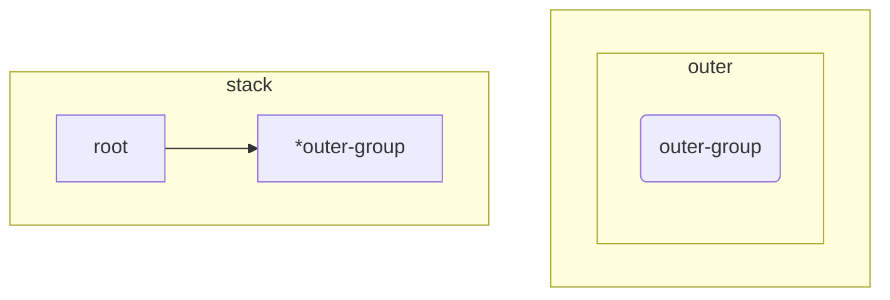
When we start the parser, a `Group` will be created which represents the whole expression. We'll call this `outer-group`. The stack will be initialized with a pointer to `outer-group`.

After processing `'a'`, the parser will look like this.

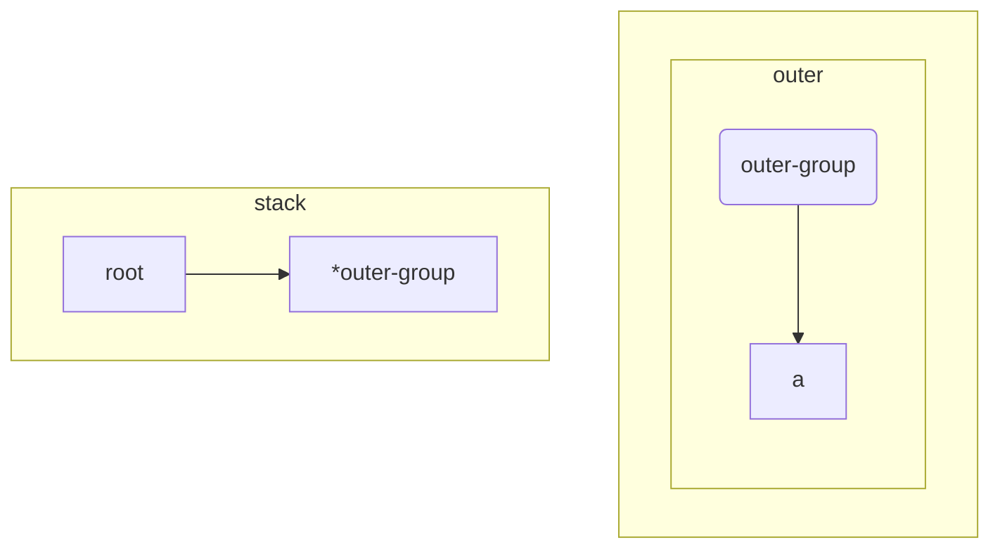

A `CharacterLiteral(a)` is simply appended to the group on top of the stack; `outer-group`.

When an opening parenthesis `'('` symbol is encountered, a new group, which we'll call `inner-group`, will be created, and a pointer to it will be pushed onto the stack.

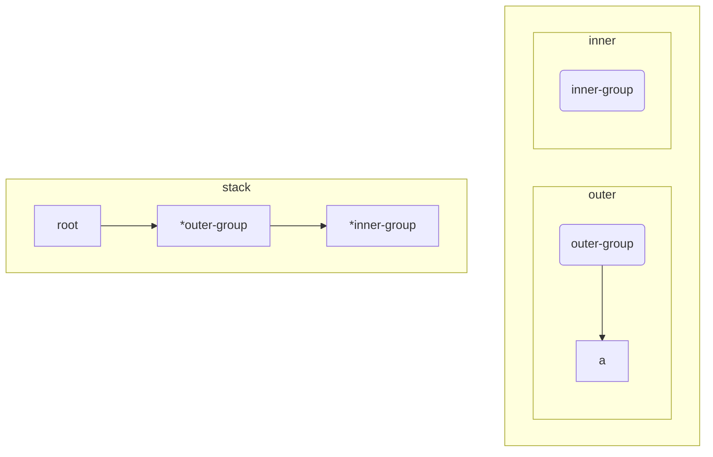

Now, when `'b'` is processed, it will be appended to the new `inner-group` `Node` as it is the last `Node` on the stack.

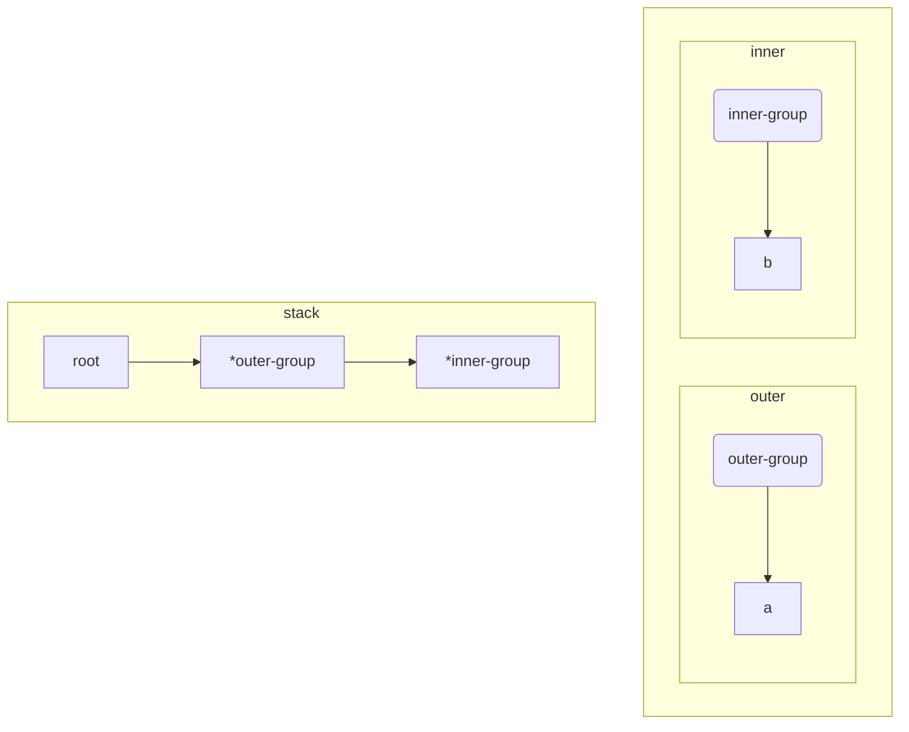

The branch symbol `|` will convert the top node on the stack into a branch, add the group as a child of the branch, add a new group, and push the branch pointer onto the stack:

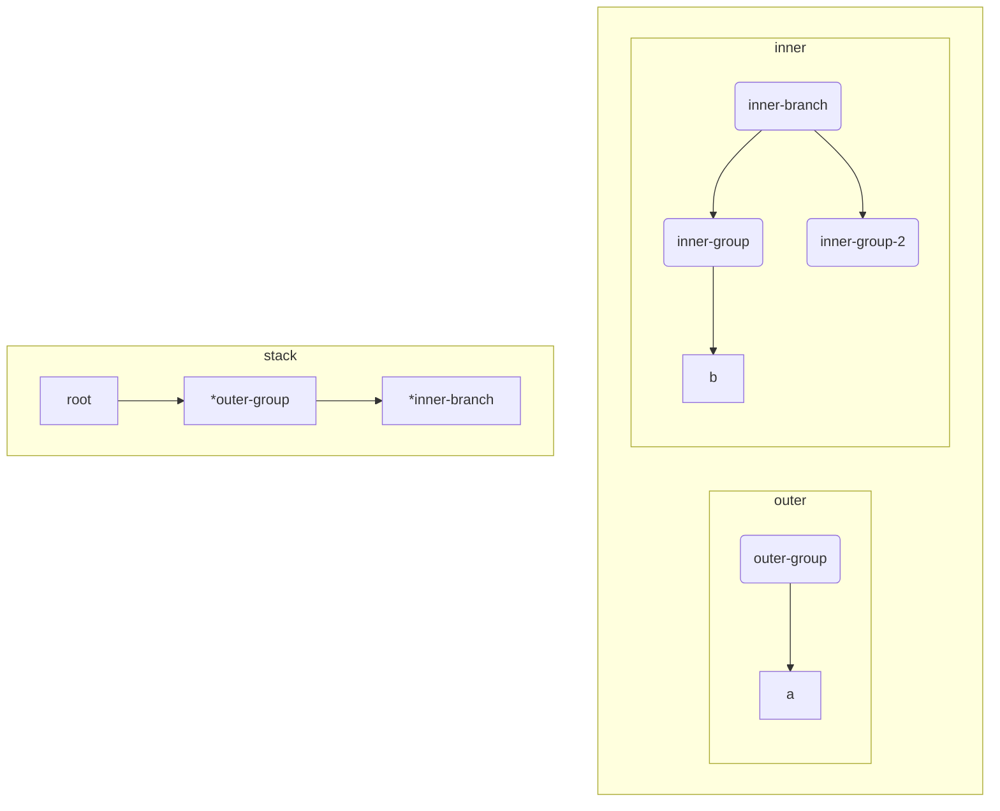
And now the next character symbol `'c'` will be applied to top `Node` of the stack - `inner-branch`, which will apply it to its last child - `inner-group-2`

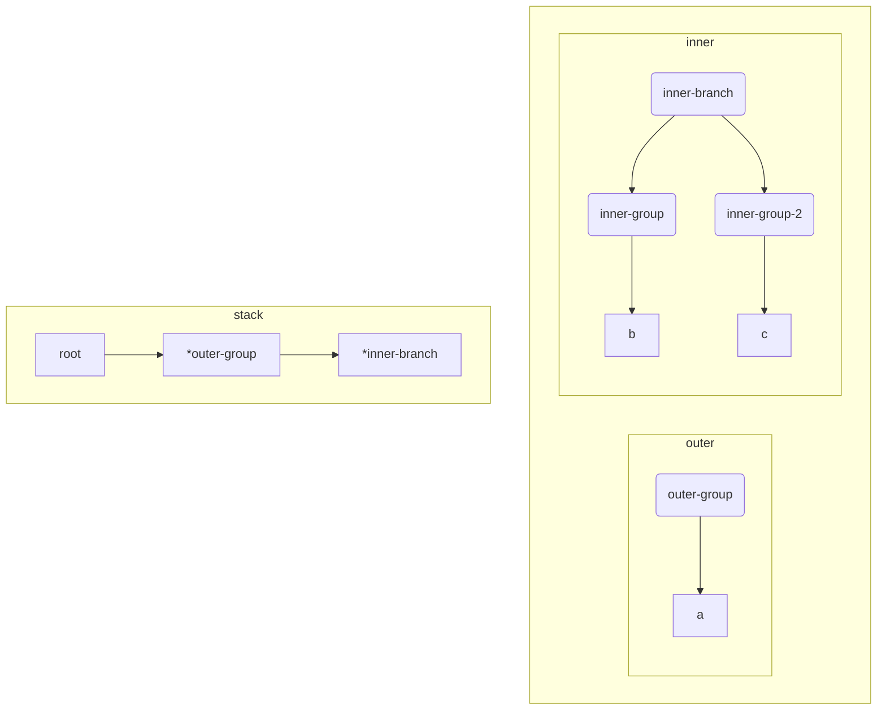

Finally, we encounter the closing parenthesis symbol `)`. This will pop `inner-branch` and `outer-group` from the stack, append `inner-branch` to `outer-group`, and then push the pointer to `outer-group` back onto the stack.

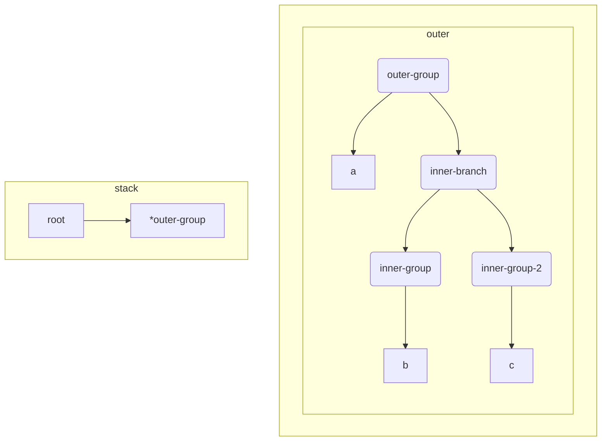

As we've reached the end of the expression, we simply pop the last element off the stack - `outer-group` and return it.

The power of using the `stack` data structures should be evident here. In our example, we only went two levels deep - the outer group and the inner group - but there's no reason that we couldn't go 3, 4, or any number of levels deep. 

The stack takes care of 'remembering' the previous levels, so we only need to care about processing the innermost level, then reduce the top two levels into one when we collapse a group. Because of this behaviour, stacks are particularly useful for parsing nested structures of arbitrary depth.

That should be enough to get our test to pass!

```zsh
=== RUN   TestFSMAgainstGoRegexPkg/concatenated_word_with_grouped_branch
--- PASS: TestFSMAgainstGoRegexPkg (0.00s)
```
 
 Let's run our fuzzer again and see if we're missing something.

Our fuzzer finds an interesting error.

```zsh
fuzz: elapsed: 0s, gathering baseline coverage: 5/664 completed
--- FAIL: FuzzFSM (0.07s)
    --- FAIL: FuzzFSM (0.00s)
        fsm_test.go:144: Mismatch - 
            Regex: '(((()0))0)' (as bytes: 28282828293029293029), 
            Input: '0' (as bytes: 30) 
            -> 
            Go Regex Pkg: 'false', 
            Our regex result: 'true'
```

I think I can reduce this error into one a bit more manageable, which I'll add as a test case.

```diff

@@ // fsm_test.go

@@ func TestFSMAgainstGoRegexPkg(t *testing.T) {
 
                // group
                {"word followed by group", "1(|)", "0"},
+               {"empty group concatenation", "(()0)0", "0"},

```

We can understand this error by looking at the `merge` function when compiling empty groups.

## Compiling groups

Let's take a look at our merge function code.

```go
// state.go

// adds the transitions of other State (s2) to this State (s).//  
// warning: do not use if State s2 has any incoming transitions.  
func (s *State) merge(s2 *State) {  
   if len(s2.incoming) != 0 {  
      panic(fmt.Sprintf("State (%+v) cannot be merged if it has any incoming transitions. It has incoming transitions from the following states; %+v", *s2, s.incoming))  
   }  
  
   for _, t := range s2.transitions {  
      // 1. copy s2 transitions to s  
      s.addTransition(t.to, t.predicate, t.debugSymbol)  
   }  
  
   // 2. remove s2  
   s2.delete()  
}
```

This works by taking the transitions of `s2` and copying them all over to `s`, then *deleting* `s2`. 

Let's remind ourselves visually of how this works.

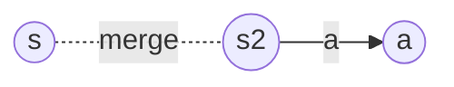

Becomes...

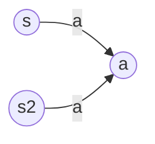

And then `State s2` is deleted

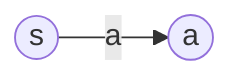

The problem is that we have a hidden assumption here - that **s2 has one or more transitions**. If `s2` doesn't have any transitions, then this type of merge doesn't work, as there are no transitions to copy. This is what's happening when we try to concatenate to an empty string in the regular expression `(()0)0`, the merge between `()` and `0` simply breaks down.

What we need is a way of saying "being in state S is equivalent to being in state S2", and epsilons do just that.

We could modify our `merge` method to conditionally join the two states with an epsilon in the case that `s2` has no transitions. This would work for our current case, but it turns out there's a more general solution here. We can simply join all a `Groups` child components with epsilon transitions instead of by using the `merge` method.

```diff
@@ // ast.go

func (g *Group) compile() (head *State, tail *State) {
		startState := State{}  
		currentTail := &startState
 
        for _, expression := range g.ChildNodes {
                nextStateHead, nextStateTail := expression.compile()
-               currentTail.addEpsilon(nextStateHead)
+               currentTail.merge(nextStateHead)
                currentTail = nextStateTail
        }

		return &startState, currentTail
}
```

This works because it says "The end of `childNode` A is equivalent to the beginning of `childNode` B". Let's see what our visualizer shows us;

```zsh
go run ./... v8 draw "abc" "abc"  
```


We can see the compiled `childNodes` in our simple example. 

- `State 0` → starting state
- `State 1 - State 2` → compiled `childNode('a')`
- `State 3 - State 4` → compiled `childNode('b')`
- `State 5 - State 6` → compiled `childNode('c')`

When these are chained together using epsilon transitions, the effect is the equivalent of merging the states pairs `(0,1)`, `(2,3)` and `(4,5)`. 

This is an **excellent tool for state machine composition**, because **it allows us to chain together any two state machines, regardless of how they work internally**. We can have two arbitrarily complex state machines, and, as long as the last state of one is joined to the first state of the other with an epsilon transition, we can consider them as one concatenated state machine.

It does, however, mess up our visualizations for simple string concatenations such as `'abc'`, so I think it's worth making a small exception for chaining together strings of `CharacterLiteral` nodes.

```diff
@@ // ast.go

@@ func (g *Group) compile() (head *State, tail *State) {
 
        for _, expression := range g.ChildNodes {
                nextStateHead, nextStateTail := expression.compile()
-               _, isChar := expression.(CharacterLiteral)
-               if isChar {
-                       currentTail.merge(nextStateHead)
-               } else {
-                       currentTail.addEpsilon(nextStateHead)
-               }
+               currentTail.merge(nextStateHead)
                currentTail = nextStateTail
        }

```

This gives us a clearer picture for simple string concatenation, but our tests still pass!


So our tests are now passing, let's go back to our fuzzer.

```zsh
--- FAIL: FuzzFSM (0.14s)
    --- FAIL: FuzzFSM (0.00s)
        fsm_test.go:145: Mismatch - 
            Regex: '(|)1' (as bytes: 287c2931), 
            Input: '0' (as bytes: 30) 
            -> 
            Go Regex Pkg: 'false', 
            Our regex result: 'true'

```

Interestingly, this looks very similar to our previously failing case of `1(|)`. Let's fix it.

### Fixing the Branch compiler

First, a test case.

```diff
@@ // fsm_test.go

@@ func TestFSMAgainstGoRegexPkg(t *testing.T) {
                {"branch with shared characters", "dog|dot", "dot"},
                {"branch with right side empty", "a|", ""},
                {"branch with left side empty", "|a", ""},
 
                // group
                {"word followed by group", "1(|)", "0"},
+               {"group followed by word", "(|)1", "0"},
```

Let's use our visualizer to check the FSM.

```zsh
go run ./... v8 draw "(|)1"
```

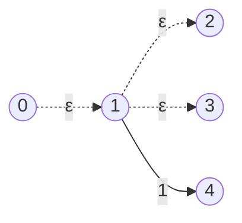

Well, that's clearly not correct. It seems that the compiled `CharacterLiteral` node for `'1'` is being added as a third branch to the compiled `Branch` node `'(|)'`. 

The reason for this is in the `Branch` struct `compile` method.

```go
// ast.go 

func (b *Branch) compile() (head *State, tail *State) {  
   for _, expression := range b.ChildNodes {  
      nextStateHead, _ := expression.compile()  
      startState.addEpsilon(nextStateHead)  
   }  
   return startState, startState  
}
```

As we can see from the `return` statement, we are not passing back the last `State` of the compiled `Node`. In fact, there is no last `State`! To illustrate the problem, which is the last `State` in the following FSM?

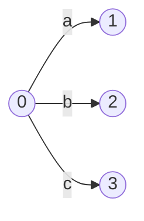

Both `States` 1, 2 and 3 could all be considered the last `State`, how can we decide? The answer, again, is epsilon transitions. Using epsilons, we can say that `State 1,2 ` and `3` are all equivalent to a new `State`, `State 4`, which is the last `State` of the FSM!

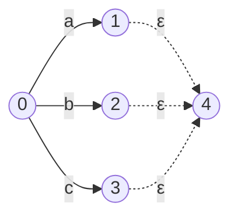

The behaviour is exactly the same, only the composition becomes easier.

Let's add this to the code.

```diff
@@ // ast.go

 func (b *Branch) compile() (head *State, tail *State) {
        startState := &State{}
+       endState := &State{}
        for _, expression := range b.ChildNodes {
-               nextStateHead, _ := expression.compile()
+               nextStateHead, tail := expression.compile()
                startState.addEpsilon(nextStateHead)
+               tail.addEpsilon(endState)
        }
-       return startState, startState
+       return startState, endState
 }
```

And let's check our generated FSM again.

```zsh
go run ./... v8 draw "(|)1"
```

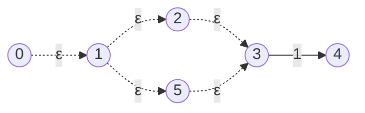

That's better, and our tests should now be green!

{}
It should be quite clear that the above FSM does a lot of unnecessary work. In fact, all the epsilon transitions could be eliminated and the FSM would still be correct! There are ways to reduce this unnecessary bloat, and hopefully I'll get around to optimization. For now, correctness is enough for me.
{}


{} 
Check out this part of the project on GitHub [here](https://github.com/LeweyM/search/tree/master/src/v7)
{} 