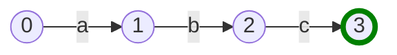
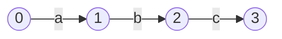
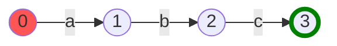
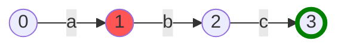
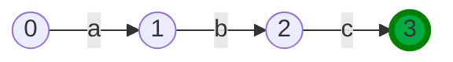


Now that we have a few features working, this is a good time to take a step back and build some things to help us see what we're working with. The tools we're going to build now will help with debugging as our features become more complex, and will give us a clearer picture of the logic of the systems we're working with.

As a side note, I also think it's worth mentioning that an important part of building a (kinda) sophisticated system is maintaining the developer infrastructure around it. That can be anything from tests, build tools, debugging tools - anything that helps you get your head around the system and manage that complexity.

So, let's build something to help us *see*.

## Visualizing Graphs

The issue we have is that it's not very easy to visualize a set of connected nodes (a graph) using variables and text. We *could* do it, and trace the pointer hashes from one object to the next, but it's not going to be very fun. As our system scales in complexity, this method will get more and more tedious.

As the old adage goes, a picture tells a thousand words...

We're going to produce something like this:


This visual representation of our FSM will give us a quick insight into whether we've compiled the regular expression correctly, and let us run through the steps ourselves to check when things go wrong.

This was created using `mermaid.js`.

## Mermaid.js for graphs

`mermaid.js` is a fantastic tool which allows us to write graphs in standard markdown which can be then rendered in the browser. The markdown for the above graph is the following;

```markdown
graph LR
	0((0)) --a--> 1((1))
	1((1)) --b--> 2((2))
	2((2)) --c--> 3((3))
	style 3 stroke:green,stroke-width:4px;
```

{} 
`mermaid` is much more powerful than this and has all sorts of wild and wonderful features. Check out [the docs](https://mermaid-js.github.io/mermaid) and see.
{} 

This is simple enough, we just need to parse our `States` and `Transitions` into the numbers and arrows in the markdown above.

As always, let's start with some tests to help define our objective.

```go
// draw_test.go

func abcBuilder() *State {  
   state1, state2, state3, state4 := &State{}, &State{}, &State{}, &State{}  
  
   state1.addTransition(state2, Predicate{allowedChars: "a"}, "a")  
   state2.addTransition(state3, Predicate{allowedChars: "b"}, "b")  
   state3.addTransition(state4, Predicate{allowedChars: "c"}, "c")  
   return state1  
} 
  
func Test_DrawFSM(t *testing.T) {  
   type test struct {  
      name, expected string  
      fsmBuilder     func() *State  
   }  
  
   tests := []test{  
      {  
         name:       "simple example",  
         fsmBuilder: abcBuilder,  
         expected: `graph LR  
0((0)) --"a"--> 1((1))  
1((1)) --"b"--> 2((2))  
2((2)) --"c"--> 3((3))
style 3 stroke:green,stroke-width:4px;`,  
      },  
   }  
  
   for _, tt := range tests {  
      t.Run(tt.name, func(t *testing.T) {  
         drawing := tt.fsmBuilder().Draw()  
  
         if drawing != tt.expected {  
            t.Fatalf("Expected drawing to be \n\"%s\", got\n\"%s\"", tt.expected, drawing)  
         }  
      })  
   }  
}
```

This test is pretty straight forward, let's just zoom in on a couple of things.

We're expecting to build a simple `mermaid` graph with numbered nodes and arrow transitions labeled with letters, such as `0((0)) --"a"--> 1((1))`. We also want our success node (in this case it's node 3) to look different, so we're giving it a thicker green outline with `style 3 stroke:green,stroke-width:4px`.

The first thing to note here is that we're building our FSMs by hand here in the helper function `abcBuilder()`. This is because we don't want changes in our compiler or parser to break these tests - they should only be concerned with how FSMs are drawn.

The next thing to note is the new `.Draw()` method on the `State` struct. This is what we need to implement to get these tests to pass. Once we have a `State` constructed, we simply call `.Draw()` and check that the `mermaid` graph is as we expect.

Now that we have some red tests, we can start implementing the `Draw()` method.

## Traversal

We need a line for every `Transition` in our FSM. Generically speaking, this means we need to look at every 'vertex' in our 'directed graph' (digraph). So, what we have here is a **graph traversal problem**. 

There are two generic ways to traverse a graph; Breadth-First Search (BFS) and Depth-First Search (DFS). How we visit every vertex will determine the order of the lines in our `mermaid` markdown. It doesn't make a huge difference, but DFS should lead to longer chains of connected nodes being drawn first. Another advantage of DFS is that our traversal algorithm can be defined recursively.

Our algorithm for collecting all the `Transitions` of the FSM should look something like this;

```go
// from the root node

1. If the current node has already been visited, stop.
2. Add the transitions from this node to a set of transitions.
3. Mark the current node as visited.
4. Recur on the destination node of every outgoing transition.
```

In this algorithm, we have a common need - we need to maintain a set of `Transitions` and `States`, as well as maintain their insertion order. The insertion order will be necessary for printing the `Transitions` in the correct order, as well as numbering the `State` nodes correctly.

I won't labor the point here, as it's tricky to visualize what's going on and distracts from what we're trying to do here. If this is mysterious to you, try walking step by step through the call stack and see where you end up.

Let's build a generic `OrderedSet` data structure to manage this for us.

## OrderedSet

We can use the new Generics features of Go 1.18 to write this generically and use the same structure for both 'visited' `*States` and `Transitions`.

{} 
Notice that we want a set of `State` pointers, and a set of concrete `Transitions`. This is because `Transitions` contain all of their identifying information, such as their `to` and `from` states, and the predicate, as fields in the struct. `States`, on the other hand, require a reference to be identified.
{} 

Before we get into the generic implementation, we need to do some refactoring of `Transition` in order to make it `comparable` in Go (not a slice, map, or function type). 

### Modifying the Transition object

In go, an object is `comparable` when all of its fields are also `comparable`, and currently the `predicate` field of a `Transition` is a function type. Let's change that now.

```diff
@@ // transition.go

- type Predicate func(input rune) bool
```

Instead, let's use a struct which can have either a string of allowed or disallowed chars[^generics].

[^generics]: This feels pretty clunky. I would have preferred a dynamic type which implements an interface, but interface fields on structs also have problems implementing the `comparable` interface. So far, generics are still tricky to make work in Go, but it's still early days.

```go
// transition.go

type Predicate struct {  
   allowedChars    string  
   disallowedChars string  
}  
  
func (p Predicate) test(input rune) bool {  
   if p.allowedChars != "" && p.disallowedChars != "" {  
      panic("must be mutually exclusive")  
   }  
  
   if len(p.allowedChars) > 0 {  
      return strings.ContainsRune(p.allowedChars, input)  
   }  
   if len(p.disallowedChars) > 0 {  
      return !strings.ContainsRune(p.disallowedChars, input)  
   }  
   return false  
}
```

Also, let's add a handy symbol for drawing our transitions.

```diff
@@ // transition.go

type Transition struct {  
+   debugSymbol string  
   // to: a pointer to the next state   
   to        *State  
   from      *State  
   predicate Predicate  
}
```

```diff
@@ // state.go

-func (s *State) addTransition(destination *State, predicate Predicate) {
+func (s *State) addTransition(destination *State, predicate Predicate, debugSymbol string) {
        t := Transition{
-               to:        destination,
-               predicate: predicate,
+               debugSymbol: debugSymbol,
+               to:          destination,
+               from:        s,
+               predicate:   predicate,
        }
        s.transitions = append(s.transitions, t)
 }


func (s *State) merge(s2 *State) {
        for _, t := range s2.transitions {
                // 1. copy s2 transitions to s
-               s.addTransition(t.to, t.predicate)
+               s.addTransition(t.to, t.predicate, t.debugSymbol)
        }
 
        // 2. remove s2
		s2.delete()
}
```

```diff
@@ // ast.go

func (l CharacterLiteral) compile() (head *State, tail *State) {
        startingState := State{}
        endState := State{}
 
-       startingState.addTransition(&endState, func(input rune) bool { return input == l.Character })
+       startingState.addTransition(&endState, Predicate{allowedChars: string(l.Character)}, string(l.Character))
        return &startingState, &endState
 }
 
func (w WildcardLiteral) compile() (head *State, tail *State) {
        startingState := State{}
        endState := State{}
 
-       startingState.addTransition(&endState, func(input rune) bool { return input != '\n' })
+       startingState.addTransition(&endState, Predicate{disallowedChars: "\n"}, ".")
        return &startingState, &endState
 }

```

And let's make a few changes so that our problem compiles.

```diff
@@ // state.go

 func (s *State) firstMatchingTransition(input rune) *State {
        for _, t := range s.transitions {
+               if t.predicate.test(input) {
-               if t.predicate(input) {
                        return t.to
                }
        }

	return nil
}

// ...

func (l CharacterLiteral) compile() (head *State, tail *State) {
        startingState := State{}
        endState := State{}
 
-       startingState.addTransition(&endState, func(input rune) bool { return input == l.Character }, string(l.Character))
+       startingState.addTransition(&endState, Predicate{allowedChars: string(l.Character)}, string(l.Character))
        return &startingState, &endState

// ...

func (w WildcardLiteral) compile() (head *State, tail *State) {  
   startingState := State{}  
   endState := State{}  
-  startingState.addTransition(&endState, func(input rune) bool { return input != "\n" }, string(l.Character))  
+  startingState.addTransition(&endState, Predicate{disallowedChars: "\n"}, ".")  
   return &startingState, &endState  
}

```

And now, let's build our generic `OrderedSet` struct. Our struct will need the following interface, where `T` is the generic type:
- `add(ts ...T)`
- `has(t T) bool`
- `list() []T`
- `getIndex(t T) int`

Let's write that out.

```go
// orderedset.go

// OrderedSet maintains an ordered set of unique items of type <T>type 
OrderedSet[T comparable] struct {  
   set       map[T]int  
   nextIndex int  
}  
  
func (o *OrderedSet[T]) add(ts ...T) {  
   if o.set == nil {  
      o.set = make(map[T]int)  
   }  
  
   for _, t := range ts {  
      if !o.has(t) {  
         o.set[t] = o.nextIndex  
         o.nextIndex++  
      }  
   }  
} 
  
func (o *OrderedSet[T]) has(t T) bool {  
   _, hasItem := o.set[t]  
   return hasItem  
}  
  
func (o *OrderedSet[T]) list() []T {  
   size := len(o.set)  
   list := make([]T, size)  
  
   i := 0  
   for t := range o.set {  
      list[i] = t  
      i++  
   }  
  
   sort.Slice(list, func(i, j int) bool {  
      return o.getIndex(list[i]) < o.getIndex(list[j])  
   })  
  
   return list  
}
  
func (o *OrderedSet[T]) getIndex(t T) int {  
   return o.set[t]  
}
```

We've changed the implementation here slightly by storing the index in the `set` field. This makes our `list` method a little more awkward, but it makes it easier to get the index of any item in the set, which will be useful for finding the numbers of our nodes.

Now we have all the pieces we need for our traversal algorithm.

## Writing the node traversal algorithm

Because of the useful data structures we've just dreamed up, writing the traversal algorithm maps pretty simply to the pseudocode we described earlier.

```go
// draw.go

func visitNodes(  
   node *State,  
   transitions *OrderedSet[Transition],  
   visited *OrderedSet[*State],  
) {  
   // 1. If the current node has already been visited, stop.  
   if visited.has(node) {  
      return  
   }  
  
   // 2. Add the transitions from this node to a set of transitions.  
   for _, transition := range node.transitions {  
      transitions.add(transition)  
   }  
  
   // 3. Mark the current node as visited.  
   visited.add(node)  
  
   // 4. Recur on the destination node of every outgoing transition.  
   for _, transition := range node.transitions {  
      destinationNode := transition.to  
      visitNodes(destinationNode, transitions, visited)  
   }  
}
```

It's important that the `transitions` and the `visited` `OrderedSets` are passed by reference using pointers. They should be the same instance in every recursive call, as we want to collect `Transitions` and mark `Nodes` as visited across the whole graph.

Once we have collected the `Transitions`, we now just have to draw them as lines in our `mermaid` markdown.

```go
// draw.go

func (s *State) Draw() string {  
   // initialize sets  
   transitionSet := OrderedSet[Transition]{}  
   nodeSet := OrderedSet[*State]{}  
  
   // collect transitions  
   visitNodes(s, &transitionSet, &nodeSet)  
  
   output := []string{  
      "graph LR",  
   }  
  
   // draw transitions  
   for _, t := range transitionSet.list() {  
      fromId := nodeSet.getIndex(t.from)  
      toId := nodeSet.getIndex(t.to)  
      output = append(output, fmt.Sprintf("%d((%d)) --\"%s\"--> %d((%d))", fromId, fromId, t.debugSymbol, toId, toId))  
   }  

  
	// draw outline around success nodes  
	for _, state := range nodeSet.list() {  
	   if state.isSuccessState() {  
	      output = append(output, fmt.Sprintf("style %d stroke:green,stroke-width:4px;", nodeSet.getIndex(state)))  
	   }  
	}

   return strings.Join(output, "\n")  
}
```

Once all the hard work of collecting the `Nodes` and `Transitions` is done, it's quite simple to concatenate the strings required to build the `mermaid.js` code. I won't go into much more detail here, as the code seems to speak for itself.

With all this in place, let's run our tests. Looks like we're green!

One more thing, let's add a quick method on the `myRegex` struct to call the root `State.Draw()` method.

```go
// regex.go
  
func (m *myRegex) DebugFSM() string {  
   graph := m.fsm.Draw()  
   return graph  
}
```

## A quick command line tool

Let's add one more thing before we finish with our visualizer. We want to be able to use it, quickly and easily, so let's make a command that we can run which takes a regular expression and shows us what the compiled FSM looks like.

Let's set up a `main` function[^2].

[^2]: I prefer some misdirection between the main function in order to strip away unnecessary command arguments. You might prefer to simply call `Draw` from the `main` package.

```go
// main.go

package main

func main() {  
   switch os.Args[1] {  
   case "v5":  
      v5.Main(os.Args[2:])  
      return  
   }
}
```

```go
// v5/main.go

package v5

// Main just used for linking up the main functions
func Main(args []string) {  
   switch args[0] {  
   case "draw":  
      if len(args) == 2 {  
         RenderFSM(args[1])  
      }
   default:  
      panic("command not recognized")  
   }  
}
```

With that, we can call `Draw` from our command. Let's test that things are set up correctly.

```go
// draw.go

func Draw(input string) {
	fmt.Println("Draw called with " + input)
}
```

We can run the program with `go run ./.. v5 draw {input}`.

```zsh
➜  search git:(master) ✗ go run ./... v5 draw "abc"

Draw called with abc
```

Great, let's make `Draw()` open a browser and display our `mermaid` code. 

```go
// main.go

// RenderFSM will render just the finite state machine, and output the result to the browser
func RenderFSM(input string) {  
   graph := NewMyRegex(input).DebugFSM()  
   html := buildFsmHtml(graph)  
   outputToBrowser(html)  
}

func buildFsmHtml(graph string) string {  
   return renderWithTemplate(fsmTemplate, graph)  
}

func renderWithTemplate(tmplt string, data any) string {  
   t, err := template.New("graph").Parse(tmplt)  
   if err != nil {  
      panic(err)  
   }  
   w := bytes.Buffer{}  
   err = t.Execute(&w, data)  
   if err != nil {  
      panic(err)  
   }  
   return w.String()  
}

  
func outputToBrowser(html string) {  
   reader := strings.NewReader(html)  
   err := browser.OpenReader(reader)  
   if err != nil {  
      panic(err)  
   }  
}
```

The template we're using here in the constant `fsmTemplate` is defined in the following [github link](https://github.com/LeweyM/search/blob/c31ebe6066a6cabd74ef2afadaee20a81a875d2a/src/v5/templates.go#L14-L24). This is some dirty and ugly HTML. It gets the job done, but it's not something I want to focus on here - if you're following along with this guide, I suggest you copy it directly from github.

Let's try that again. It should now open a browser with a visualisation of your compiled FSM!


That's better. This tool is going to come in very handy as our program grows in complexity.

So, we can visualize what a compiled FSM looks like, but what would be great is if we could also see our *runner processing each of the characters*. This would give us a wonderful insight into the characteristics of our algorithm.

Let's do that now.

## Visualizing the Runner

What I want is to be able to open up a browser with an animation that shows me;
1. The compiled FSM (as we just showed)
2. Which character of the input I'm currently processing.
3. Which is the current active state in the FSM.

We already implemented (1), so now we need a way of showing (2) where we are in the input string and (3) which state is currently active for each step of the algorithm. To be clear, when I write 'step', I refer to the processing of a character via the `Next(input rune)` method in our `runner`.

In terms of displaying this information, we can do this by simply rendering every step of the algorithm in the browser, and then use JavaScript to reveal one of the steps and hide the others when the arrow keys are pressed. This will give the impression of stepping backwards and forwards through the algorithm[^js].

[^js]: If for some reason you're interested in the hacky javascript involved in this, take a look at the `templates.go` file in [github](https://github.com/LeweyM/search/blob/master/src/v5/templates.go).

We need a way of drawing the graph each step in the algorithm. In this case, the algorithm in question is the `match` algorithm, so let's create a `DebugMatch()` function on our `myRegex` struct to handle this.

```go
// regex.go

func (m *myRegex) DebugMatch(input string) []debugStep {
	// todo: implement me
}
```

This returns a slice of `debugSteps`, which contains everything we need in order to render a single step in the algorithm. Namely, a drawing of the runner in the current moment, and the index of the character we're processing in the current moment.

```go
// regex.go 

type debugStep struct {  
   runnerDrawing         string  
   currentCharacterIndex int  
}
```

Let's start with a test;

```go
// draw_test.go

func aaaBuilder() *State {  
   state1, state2, state3, state4 := &State{}, &State{}, &State{}, &State{}  
  
   state1.addTransition(state2, Predicate{allowedChars: "a"}, "a")  
   state2.addTransition(state3, Predicate{allowedChars: "a"}, "a")  
   state3.addTransition(state4, Predicate{allowedChars: "a"}, "a")  
   return state1  
}

func Test_DrawSnapshot(t *testing.T) {  
   type test struct {  
      name, input, expected string  
      fsmBuilder            func() *State  
   }  
  
   tests := []test{  
      {  
         name:       "initial snapshot",  
         fsmBuilder: abcBuilder,  
         input:      "",  
         expected: `graph LR  
0((0)) --"a"--> 1((1))  
1((1)) --"b"--> 2((2))  
2((2)) --"c"--> 3((3))  
style 3 stroke:green,stroke-width:4px;
style 0 fill:#ff5555;`,  
      },  
      {  
         name:       "after a single letter",  
         fsmBuilder: abcBuilder,  
         input:      "a",  
         expected: `graph LR  
0((0)) --"a"--> 1((1))  
1((1)) --"b"--> 2((2))  
2((2)) --"c"--> 3((3)) 
style 3 stroke:green,stroke-width:4px;
style 1 fill:#ff5555;`,  
      },  
      {  
         name:       "last state highlighted",  
         fsmBuilder: aaaBuilder,  
         input:      "aaa",  
         expected: `graph LR  
0((0)) --"a"--> 1((1))  
1((1)) --"a"--> 2((2))  
2((2)) --"a"--> 3((3))  
style 3 stroke:green,stroke-width:4px;
style 3 fill:#00ab41;`,  
      },  
   }  
  
   for _, tt := range tests {  
      t.Run(tt.name, func(t *testing.T) {  
         runner := NewRunner(tt.fsmBuilder())  
         for _, char := range tt.input {  
            runner.Next(char)  
         }  
         snapshot := runner.drawSnapshot()  
  
         if !reflect.DeepEqual(tt.expected, snapshot) {  
            t.Fatalf("Expected drawing to be \n\"%v\"\ngot\n\"%v\"", tt.expected, snapshot)  
         }  
      })  
   }  
}
```

This should look familiar to our previous `Test_DebugFSM` test, with the biggest difference being that we are now returning a 'snapshot' of the runner after having processed some input. This includes the highlighting of the currently active states.

Zoom in on the first test, which is after having processed the string `"a"` for the regular expression `"abc"`.

```go
`graph LR  
0((0)) --"a"--> 1((1))  
1((1)) --"b"--> 2((2))  
2((2)) --"c"--> 3((3))  
style 3 stroke:green,stroke-width:4px;
style 0 fill:#ff5555;`
```

One thing that wasn't in the previous test is the last line.

```markdown
style 0 fill:#ff5555;
```

This gives a color `#ff5555` to the node with the label '`0`'. Let's see what this looks like with `mermaid`.


The red node means that the current state is `State` '`0`'. Let's change the last line to `style 1 fill:#ff5555`


So, by changing which node we style, we can demonstrate the currently active state 'moving' across our FSM.

Finally, some might notice that the last graph in our test has a different color. 



The green node means that the runner has landed in an end state, and so the match was successful. 

Now we know what we're trying to build, let's start implementing the `runner.drawSnapshot` function. 

### Draw Snapshot

Drawing a snapshot of the runner is actually quite simple.

First, we're going to need to modify the `Draw` function to return the `nodeSet` object. This is because we'll need to know the labels of the nodes in order to highlight them.

```diff
@@ // draw.go

- func (s *State) Draw() string {  
+ func (s *State) Draw() (graph string, nodeSet OrderedSet[*State]) {  
   // initialize sets  
   transitionSet := OrderedSet[Transition]{}  
   nodeSet = OrderedSet[*State]{}  
  
   // collect transitions  
   visitNodes(s, &transitionSet, &nodeSet)  
  
   output := []string{  
      "graph LR",  
   }  
  
   // draw transitions  
   for _, t := range transitionSet.list() {  
      fromId := nodeSet.getIndex(t.from)  
      toId := nodeSet.getIndex(t.to)  
      output = append(output, fmt.Sprintf("%d((%d)) --\"%s\"--> %d((%d))", fromId, fromId, t.debugSymbol, toId, toId))  
   }  

	// draw outline around success nodes  
	for _, state := range nodeSet.list() {  
	   if state.isSuccessState() {  
	      output = append(output, fmt.Sprintf("style %d stroke:green,stroke-width:4px;", nodeSet.getIndex(state)))  
	   }  
	}

-   return strings.Join(output, "\n")  
+   return strings.Join(output, "\n"), nodeSet
}
```

The compiler should be complaining, so let's quickly fix those issues.

```diff
@@ // regex.go

func (m *myRegex) DebugFSM() string {  
-   graph := m.fsm.Draw()  
+   graph, _ := m.fsm.Draw()  
   return graph  
}
```

```diff
@@ // draw_test.go

@@ func Test_DrawFSM(t *testing.T) {

	for _, tt := range tests {  
	   t.Run(tt.name, func(t *testing.T) 
-         drawing := tt.fsmBuilder().Draw()  
+         drawing, _ := tt.fsmBuilder().Draw()  
	  
	      if drawing != tt.expected {  
	         t.Fatalf("Expected drawing to be \n\"%s\", got\n\"%s\"", tt.expected, drawing)  
	      }  
	   })
```

Now, we need to implement the `drawSnapshot` function. All this should do is print the `mermaid` graph of the FSM, then append the code to highlight all active states, using the `nodeSet` to get the appropriate label.

```go
// draw.go

// drawSnapshot will draw a mermaid graph from the FSM, as well as color the current node.
func (r runner) drawSnapshot() string {  
   graph, nodeSet := r.head.Draw()  
   switch r.GetStatus() {  
   case Normal:  
      graph += fmt.Sprintf("\nstyle %d fill:#ff5555;", nodeSet.getIndex(r.current))  
   case Success:  
      graph += fmt.Sprintf("\nstyle %d fill:#00ab41;", nodeSet.getIndex(r.current))  
   }  
  
   return graph  
}
```

With that in place, our tests are passing, but it's not much use unless we can modify our algorithm to print a snapshot during the different steps of the algorithm. In order to do that, we'll need to modify our `match` function.

### Changing our Match Function

In order to do this, we're going to make use of golang's `channels` to send data as the algorithm is running. 

Go `channels` are used for concurrent programs, which is not really how we're using them here. However, by using channels we can 'enqueue' data during the processing of a function without the function returning. As long as something is 'listening' on the other side of the channel, the `send` operation to the channel will not block. If you're not familiar with Go `channels`, this will likely be a bit mysterious for now, hopefully it will be clearer once we have some working code.

The upside of all this is that we don't need to modify the original algorithm too much. 

Let's start by modifying the `match` function. At each step of the search, we'll check if a `channel` is present. If it is, we'll take a snapshot of the runner and send it to the `channel`, as well as some additional data.

```diff
@@ // regex.go

-func match(runner *runner, input []rune) bool {
+func match(runner *runner, input []rune, debugChan chan debugStep, offset int) bool {
        runner.Reset()
+       if debugChan != nil {
+               debugChan <- debugStep{runnerDrawing: runner.drawSnapshot(), currentCharacterIndex: offset}
+       }
 
-       for _, character := range input {
+       for i, character := range input {
                runner.Next(character)
+               if debugChan != nil {
+                       debugChan <- debugStep{runnerDrawing: runner.drawSnapshot(), currentCharacterIndex: offset + i + 1}
+               }
                status := runner.GetStatus()
 
                if status == Fail {
-                       return match(runner, input[1:])
+                       return match(runner, input[1:], debugChan, offset+1)
                }
 
				if status == Success {  
				      return true  
			    }  
		}   
  
		return runner.GetStatus() == Success
}

```

Let's break this down a bit;

First, the signature has changed.

```diff
-func match(runner *runner, input []rune) bool {
+func match(runner *runner, input []rune, debugChan chan debugStep, offset int) bool {
```

We now pass a `chan debugStep`  channel to `match`. This is the channel to which we will output our graph drawing at each step of the algorithm. 

We also pass an `offset` integer to the function. This is because of the recursive nature of the algorithm, which means that at each step we are operating on an ever shortening substring of `input`. For example, it will operate first on the string `"abcd"`, then `"bcd"`, then `"cd"`, then `"d"`, and then finally on the empty string `""`. As we need to know which index of the *complete* `input` string we're currently at, we need to know how many characters we've already discarded. Therefore, the `offset` is incremented in every recursion to account for this.

```diff
                if status == Fail {
-                       return match(runner, input[1:])
+                       return match(runner, input[1:], debugChan, offset+1)
                }
```

The other modifications are simple, we just pass the current state of the `runner` and the `currentCharacterIndex` to the channel at each step.

```diff
        runner.Reset()
+       if debugChan != nil {
+               debugChan <- debugStep{runnerDrawing: runner.drawSnapshot(), currentCharacterIndex: offset}
+       }
 
-       for _, character := range input {
+       for i, character := range input {
                runner.Next(character)
+               if debugChan != nil {
+                       debugChan <- debugStep{runnerDrawing: runner.drawSnapshot(), currentCharacterIndex: offset + i + 1}
+               }
```

We do it before the loop in order to capture the state of the runner at the very beginning, before it has processed any characters, as well as whenever the algorithm recurs. This leads to some jumps in our animation, but it shows nicely the 'backtracking' characteristics of our algorithm.

We also capture the runner state after the `runner.Next(character)` call during the loop in order to take a snapshot of every step after a character has been processed.

And finally, we always check that `debugChan != nil` before we pass data to the `debugStep` channel so that we can ignore all of this when we're not debugging.

The compiler should be moaning at us to fix what we've broken, so let's fix that.

```diff
@@ // regex.go

 func (m *myRegex) MatchString(input string) bool {
        runner := NewRunner(m.fsm)
-       return match(runner, []rune(input))
+       return match(runner, []rune(input), nil, 0)
 }
```

That should be enough. We now have some failing tests to fix, so let's implement the `DebugMatch()` method.

```go
// regex.go

func (m *myRegex) DebugMatch(input string) []debugStep {  
   runner := NewRunner(m.fsm)  
   debugStepChan := make(chan debugStep)  
   go func() {  
      match(runner, []rune(input), debugStepChan, 0)  
      close(debugStepChan)  
   }()  
   var debugSteps []debugStep  
   for step := range debugStepChan {  
      debugSteps = append(debugSteps, step)  
   }  
  
   return debugSteps  
}
```

Again, if you're not familiar with Go `channels` this might look odd, so let's step through it.

First, we create a runner and a new `chan debugStep` 
```go
   runner := NewRunner(m.fsm)  
   debugStepChan := make(chan debugStep)
```

Then, we start a new `Go routine` which will call `match` and use our previously created channel. Once `match` has finished, the `channel` will be closed.

```go
   go func() {  
      match(runner, []rune(input), debugStepChan, 0)  
      close(debugStepChan)  
   }()  
```

Finally, we immediately start collecting the data sent to the channel and adding it to a slice. Once `match` has returned in the other `Go routine`, the `range` loop will terminate and we can return the slice.

```go
   var debugSteps []debugStep  
   for step := range debugStepChan {  
      debugSteps = append(debugSteps, step)  
   }  
  
   return debugSteps 
```

That should be enough to get our tests passing!

### A new command

We now want to be able to use this by calling something from the command line, as we did before. Let's modify our `main.go` file.

```diff
@@ // main.go

// Main just used for linking up the main functionsfunc Main(args []string) {  
   switch args[0] {  
   case "draw":  
      if len(args) == 2 {  
         RenderFSM(args[1])  
+     } else if len(args) == 3 {  
+        RenderRunner(args[1], args[2])  
+     }  
   default:  
      panic("command not recognized")  
   }  
}
```

This means that if we call our method with a single string, such as `go run ./... v5 cat`, we display the compiled FSM for the regular expression `"cat"`, but if we call with two strings, such as `go run ./... v5 cat "I love cats"`, we get a representation of our algorithm for the regular expression `"cat"` being applied to the input string `"I love cats"`.

Let's implement `RenderRunner`.

```go
// main.go

// RenderRunner will render every step of the runner until it fails or succeeds. The template will then take care// of hiding all but one of the steps to give the illusion of stepping through the input characters. It will  
// then output the result to the browser.  
func RenderRunner(regex, input string) {  
   data := buildRunnerTemplateData(regex, input)  
   htmlRunner := buildRunnerHTML(data)  
   outputToBrowser(htmlRunner)  
}

func buildRunnerTemplateData(regex string, input string) TemplateData {  
   newMyRegex := NewMyRegex(regex)  
   debugSteps := newMyRegex.DebugMatch(input)  
  
   var steps []Step  
   for _, step := range debugSteps {  
      steps = append(steps, Step{  
         Graph:      step.runnerDrawing,  
         InputSplit: threeSplitString(input, step.currentCharacterIndex),  
      })  
   }  
  
   data := TemplateData{  
      Steps: steps,  
      Regex: regex,  
   }  
   return data  
}

func buildRunnerHTML(data TemplateData) string {  
   return renderWithTemplate(runnerTemplate, data)  
}

// threeSplitString divides a string into three pieces on a given indexfunc threeSplitString(s string, i int) []string {  
   var left, middle, right string  
  
   left = s[:i]  
   if i < len(s) {  
      middle = string(s[i])  
      right = s[i+1:]  
   }  
  
   return []string{left, middle, right}  
}
```

All we're doing here is parsing the `debugSteps` from `DebugMatch` into data structures which our templates know what to do with. This includes breaking the input string into three pieces so that we can render the characters before the current character, the current character, and remaining characters in different ways.

To make this work, we just need a few template data structures, as well as the template itself, which also be found on [github](https://github.com/LeweyM/search/blob/c31ebe6066a6cabd74ef2afadaee20a81a875d2a/src/v5/templates.go#L26-L99).

```go
// templates.go
  
type TemplateData struct {  
   Steps []Step  
   Regex string  
   Input string  
}  
  
type Step struct {  
   Graph      string  
   InputSplit []string  
}  
```

Again, I won't explain this because it's nasty Javascript and it's not too interesting. Let's just try it out and see what happens!




Nice! The underlined character shows which character we're going to process next, and the letters in red are those already processed. The state in red shows the active state at any given moment.

So, we can look at the red state, ask ourselves "is there a transition which matches the character that's about to be processed?", and then we can predict which state will be active next!

Let's try another example.




We can see that most of the characters make our FSM fail immediately. We know that the `runner` has failed because there is no active state for one step. It's at this point that our algorithm resets the runner and starts the search again from the next substring. 

It's only until we reach the `cats` substring that we begin to start matching `States` and can finally progress to the final end state and declare the match a success.

Let's take a look at one more example, this time with the regular expression `aab` with the input search string `"aaaab"`




Notice what happens when we get from `State 0` to `State 2` and then fail? We have to go back a few steps in our input search string in order to search for other potential matches. This is called 'backtracking'. It's the result of the recursion in our  `match()` function, and it has serious performance implications for regex/search string combinations such as these. In these cases we have to backtrack the length of the regex on every failure. Not ideal.

I invite you to play around with different combinations and see what you can find. I found that this was of vizualising the algorithms we're using was very helpful in internalizing the characteristics. This becomes especially useful when our FSMs become more complex.

Before we finish here, I want to add one more command to save the generated HTML to a file. We'll call this command `out`.[^out]
[^out]: This is actually the command I use to generate the HTML used in the demos in this very blog!

```diff
@@ // main.go

// Main just used for linking up the main functions
func Main(args []string) {  
   switch args[0] {  
   case "draw":  
      if len(args) == 2 {  
         RenderFSM(args[1])  
      } else if len(args) == 3 {  
         RenderRunner(args[1], args[2])  
      }  
+   case "out":  
+      if len(args) == 4 {  
+         OutputRunnerToFile(args[1], args[2], args[3])  
+      }  
   default:  
      panic("command not recognized")  
   }  
}
```

And a couple of functions to implement the file writing functionality.

```go
// OutputRunnerToFile will render every step of the runner, the same as RenderRunner, and then write the html to  
// a file.  
func OutputRunnerToFile(regex, input, filePath string) {  
   data := buildRunnerTemplateData(regex, input)  
   htmlRunner := buildRunnerHTML(data)  
   outputToFile(htmlRunner, filePath)  
}

func outputToFile(html, path string) {  
   containingDir := filepath.Dir(path)  
   err := os.MkdirAll(containingDir, 0750)  
   if err != nil {  
      panic(err)  
   }  
  
   if filepath.Ext(path) == "" {  
      path += ".html"  
   }  
  
   if filepath.Ext(path) != ".html" {  
      panic("only .html extension permitted")  
   }  
  
   err = os.WriteFile(path, []byte(html), 0750)  
   if err != nil {  
      panic(err)  
   }  
}
```

That's enough of visualisations for now, let's move onto adding new features to our regex engine.

{} 
Check out this part of the project on GitHub [here](https://github.com/LeweyM/search/tree/master/src/v5)
{} 