## The OR expression

It's very useful to use a regular expression to match against multiple different possible substrings. For example, to check that a file is an image type, you might use the regular expression `"png|jpge|gif"` on the file extension. This would tell you if the file was `png` OR `jpeg` OR `gif`. The options of the OR expression are determined by the separating them with a `pipe` symbol (`"|"`). 

Let's have a look at what an FSM would look like with OR expressions. Take the regular expression `"dog|cat"` as an example.


As we can see, it looks similar to our previous examples, with the notable difference that our starting state has multiple outward `Transitions`. In this case, it can transition on both the `'d'` and the `'c'` characters. 

Let's step through this using the string `"cat"` as our input search string.


First, we process the character `'c'`, which matches the bottom transition.


Then, we process `'a'`


And finally `'t'`, which leaves us in an end state.


Pretty simple stuff! Now that we know what we're looking for, let's start coding.

We'll start at the `Parser`.

First, let's add our data structures.

### The Branch Data Structure

```go
// ast.go

type Branch struct {  
   ChildNodes []Node  
}

func (b *Branch) Append(node Node) {  
   panic("implement me")  
}

func (b *Branch) compile() (head *State, tail *State) {  
   panic("implement me")  
}
```

The structure of the `Branch` struct will be very similar to the `Group` struct - they both implement the `CompositeNode` interface and have child `Nodes`. The difference will be in how they are parsed, and how they are compiled.

## Parsing Branch AST Nodes

We're going to want to be able to represent branches as `AST` nodes, so our parser needs to know how to take a regular expression such as `cat|dog` and turn it into a `Branch` AST node with two `Group` child nodes, each containing three `CharacterLiteral` nodes. Visually, the `cat|dog` example should look like this:

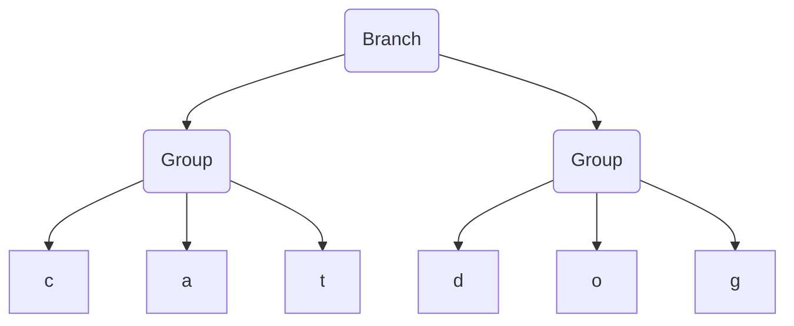

Let's start by adding a test to our `parser_test.go` file.

```diff
@@ // parser_test.go

@@ func TestParser(t *testing.T) {
+               {name: "branches", input: "ab|cd|ef", expectedResult: &Branch{ChildNodes: []Node{
+                       &Group{ChildNodes: []Node{
+                               CharacterLiteral{Character: 'a'},
+                               CharacterLiteral{Character: 'b'},
+                       }},
+                       &Group{ChildNodes: []Node{
+                               CharacterLiteral{Character: 'c'},
+                               CharacterLiteral{Character: 'd'},
+                       }},
+                       &Group{ChildNodes: []Node{
+                               CharacterLiteral{Character: 'e'},
+                               CharacterLiteral{Character: 'f'},
+                       }},
+               }}},
        }

```

Let's run those tests and see what we're working with. We get the following error message.

```zsh
Expected [&{ChildNodes:[0x1400000c0d8 0x1400000c0f0 0x1400000c108]}], got [&{ChildNodes:[{Character:97} {Character:98} {Character:99} {Character:100 {Character:101} {Character:102}]}]
```

Hmm, not very helpful. The problem is that displaying hierarchical data structures is not something that Go does very well on it's own. In this case, it's just printing our pointers. We want something more like the tests we've just written - the indentation at each level makes it obvious which `Nodes` are child nodes and which are parent `Nodes`. Let's take another quick detour and improve how we print out our AST `Nodes`.

## Debug printing AST Nodes

We want each level in the hierarchy to be indented a bit more than the previous level, so that we end up with something like this:

```zsh
level 1
  level 2
    level 3
  level 2 
  level 2
level 1
```

We can do this by telling each node which level it is at, and having it print an indentation with the length of that level before it prints the description of the `Node`. Let's start with the leaf nodes, as they're the easiest.

```go
// ast.go

func (l CharacterLiteral) string(indentation int) string {  
   padding := strings.Repeat("--", indentation)  
   return fmt.Sprintf("%sCharacterLiteral('%s')", padding, string(l.Character))  
}  
  
func (w WildcardLiteral) string(indentation int) string {  
   padding := strings.Repeat("--", indentation)  
   return fmt.Sprintf("%sWildcardCharacterLiteral", padding)  
}
```

Now, the `CompositeNodes`, which for now is only `Group`, will also need to print it's description with an indentation. The trick here is to also *ask all of it's child nodes to print with the indentation + 1*.

```go
// ast.go

func (g *Group) string(indentation int) string {  
   return compositeToString("Group", g.ChildNodes, indentation)  
}  

func (b *Branch) string(indentation int) string {  
   return compositeToString("Branch", b.ChildNodes, indentation)  
}
  
func compositeToString(title string, children []Node, indentation int) string {  
   padding := strings.Repeat("--", indentation)  
   res := padding + title  
   for _, node := range children {  
      res += fmt.Sprintf("\n%s%s", padding, node.string(indentation+1))  
   }  
   return res  
}
```

We'll also need to tell Go that every node can print using the `string(indentation int)` method, so let's add it to the `Node` interface.

```diff
@@ // ast.go

 type Node interface {
        compile() (head *State, tail *State)
+       string(indentation int) string
 }
```

And finally call these methods from the composite Nodes `String()` method so that our tests use it for output.

```go
// ast.go
  
func (g *Group) String() string {  
   return "\n" + g.string(1)  
}

func (b *Branch) String() string {  
   return "\n" + b.string(1)  
}
```

Now, let's take a look at our error message again.

```zsh
=== RUN   TestParser/branches
    parser_test.go:52: Expected:
    
        --Branch
        ----Group
        --------CharacterLiteral('a')
        --------CharacterLiteral('b')
        ----Group
        --------CharacterLiteral('c')
        --------CharacterLiteral('d')
        ----Group
        --------CharacterLiteral('e')
        --------CharacterLiteral('f')
        
        Got:
        
        --Group
        ----CharacterLiteral('a')
        ----CharacterLiteral('b')
        ----CharacterLiteral('c')
        ----CharacterLiteral('d')
        ----CharacterLiteral('e')
        ----CharacterLiteral('f')
```

That's better, we can now immediately see what's going on.

{}
It probably seems like we're spending a lot of time building things to help us visualize our system, rather than building the system itself. That's true, and this is a large investment. However, this should pay dividends when it comes to debugging issues that come up, and in simply understanding our system better. 
It's hard to give hard numbers when it comes to deciding whether a tool is worth the time it takes to build it, but considering that the implementation is fairly straight forward, I think it's easily worth it in this case.
{}

So let's fix our parser.

## Adding Pipes to our Parser

During the parsing of a string of tokens, if we come across the `Pipe` ( `'|'`) token, we want to do one of two things, depending on whether our root `Node` is a `Branch` node or not.

1. If the root `Node` is **not** a `Branch` node, want to replace the root with a new `Branch` node, which will contain the old root `Node` as its first child, and a new `Group` as its second child.
2. If the root `Node` **is** a `Branch` node, we want to 'split' the `Branch`, which basically means adding a fresh `Group` node as a child of the `Branch` node.

Let's walk through these in more detail.

### 1. Creating a new Branch node

let's parse the regex `"ab|cd"`.

First, the letter `'a'`. It simply gets appended to our root `Group` node.
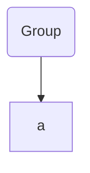

Then the same for `'b'`,
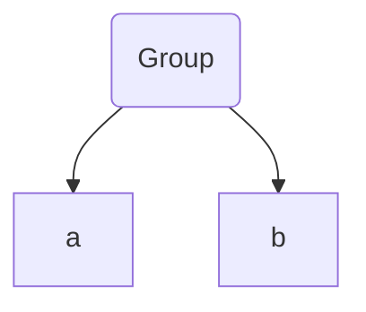
Now we have our pipe character `'|'`. With this, we should create a new `Branch` node and place our `Group` node as it's first child. This `Branch` node will become the new root `Node`. 

We should also create a new `Group` node, and it should be a new child of the `Branch` node.

We should end up with the following;
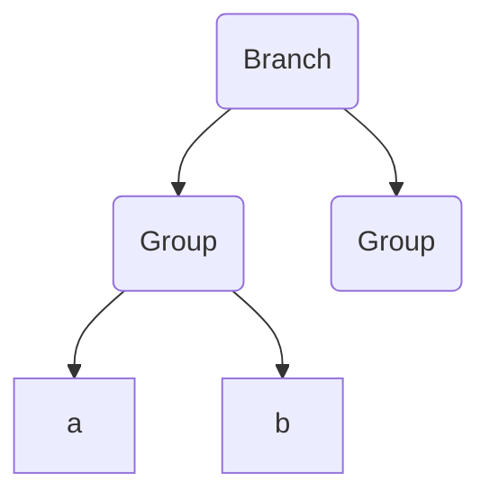
Continuing, we have `'c'`. We should now be appending new expressions to the newly created group (the second child of the root `Branch` node).
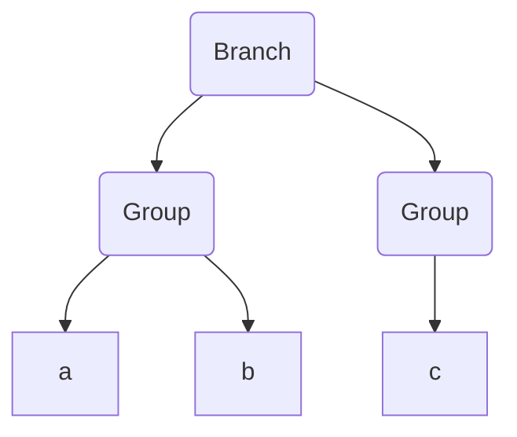
And finally, `'d'` is also added to the last child of the root `Branch` node. The `AST` parsing is now complete.

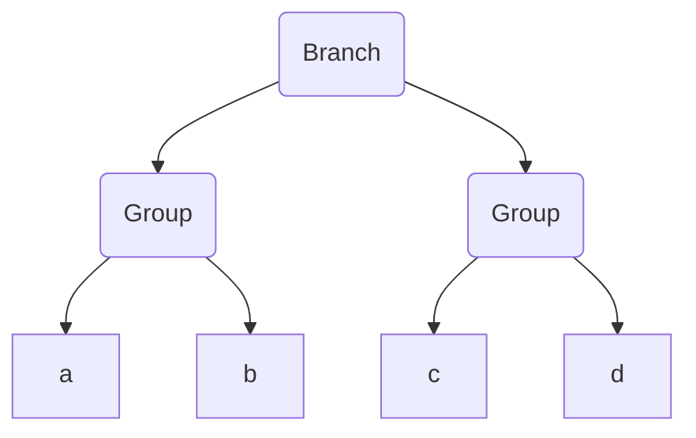

### 2. Splitting a branch

Let's try parsing the regex `a|b|c`.

First, we parse the `'a'` character. It gets added to the root `Group` node.

Now, our first `'|'` token. This uses the first option, where a new `Branch` is created and set as the root `Node`.
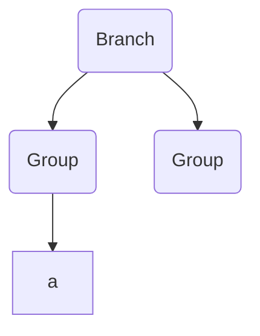
Next, an `'b'` character token. This will be appended to the last child of `Branch`.
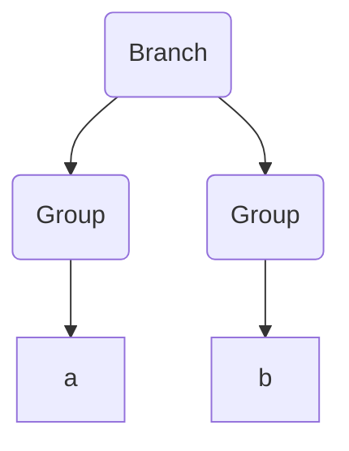

And now, our second `'|'` token. As the root is now a `Branch` node, we will 'split' this branch and create a new child with a fresh `Group` node.
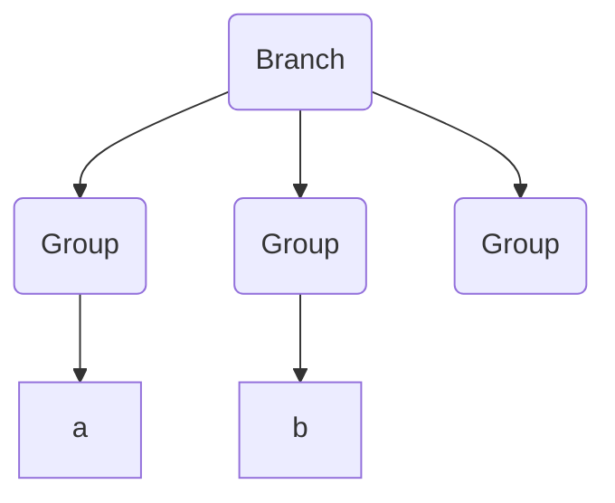

And finally, the `'c'` character will be appended to the newly created `Group` node.
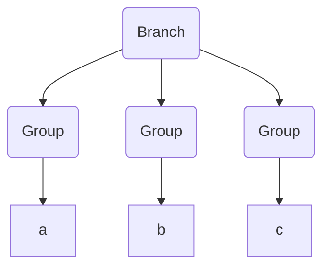

## Coding the Pipe Parser

The changes necessary for this are actually quite small. We simply need to add our `Branch` node and a new case in the parsers main `switch` statement.

First, our `Branch` node.

```go 
// ast.go

type Branch struct {  
   ChildNodes []Node  
}

func (b *Branch) Append(node Node) {  
   for i := len(b.ChildNodes) - 1; i > 0; i-- {  
      switch n := b.ChildNodes[i].(type) {  
      case CompositeNode:  
         n.Append(node)  
         return  
      }  
   }  
  
   panic("should have at least one composite node child")  
}

func (b *Branch) compile() (head *State, tail *State) {  
	panic("implement me")
}
```

The `Append` method here is interesting. We want to append to the latest child of the `Branch`, so we iterate backwards through the `ChildNodes`. We also expect that we will always have at least one `CompositeNode` child, so we should panic otherwise.

Also, we add a stand-in `compile` function to get the compiler to stop complaining.

We also need a way to 'split' the branch. This simply means adding a new child with an empty `Group` node.

```go
// ast.go

func (b *Branch) Split() {  
   b.ChildNodes = append(b.ChildNodes, &Group{})  
}
```

And then, in our parser, we add a case for processing `Pipe` tokens.

```diff
@@ // parser.go
func (p *Parser) Parse() Node {
-   root := Group{}  
+   var root CompositeNode  
+   root = &Group{}  
  
   for _, t := range p.tokens {  
       switch t.symbol {  
       case Character:  
          root.Append(CharacterLiteral{Character: t.letter})  
       case AnyCharacter:  
          root.Append(WildcardLiteral{})  
+      case Pipe:  
+         switch b := root.(type) {  
+         case *Branch:  
+            b.Split()  
+         default:  
+            root = &Branch{ChildNodes: []Node{root, &Group{}}}  
+         }  
      }  
   }  
  
-   return &root  
+   return root  
}

```

Notice that our root `Node` now has to be of the interface type `CompositeNode`, as it can now be either a `Group` or a `Branch` type.

This should be enough to get our `Parser` tests green again. Next, we need to compile this AST node into an FSM.

## Compiling a Branch node

We want to take our AST and create a valid FSM from it. This will be enough to make our implementation work, so let's start with a test before we implement anything.

```diff
@@ // fsm_test.go

@@ func TestFSMAgainstGoRegexPkg(t *testing.T) {
                {"wildcard regex matching", "ab.", "abc"},
                {"wildcard regex not matching", "ab.", "ab"},
                {"wildcards matching newlines", "..0", "0\n0"},
+
+               // branch
+               {"branch matching 1st branch", "ab|cd", "ab"},
+               {"branch matching 2nd branch", "ab|cd", "cd"},
+               {"branch not matching", "ab|cd", "ac"},
        }

```

These should be failing as we simply panic when we try to compile any `Branch` AST `Nodes`. Let's fix this.

Going from this:


To this:


Is not too difficult. They already share a lot of the same characteristics because the shape is so similar. As I've stressed in earlier chapters, parsing the structure first and then compiling the end result separately is a fantastic way to reduce the overall complexity of this operation.

For now, we can use the following algorithm for parsing a `Branch` node:

1. Create a starting `State`.
2. Compile each child node, and merge the first `State` of each child with the starting `State`.

This has some issues, as we'll see later, but for now this will work. Let's put it into code.

```go
// ast.go 

func (b *Branch) compile() (head *State, tail *State) {  
	// 1. Create a starting State.
	startState := &State{}  
	
	// 2. Compile each child node, and merge the first State of each child with the starting State.
	for _, expression := range b.ChildNodes {  
		nextStateHead, _ := expression.compile()  
		startState.merge(nextStateHead)  
	}  
	return startState, startState  
}
```

That should be enough to successfully compile a `Branch` node. Our tests should now be green, so let's see what we've created by using our visualizer tools.

Let's see what happens when we run the `draw "ab|cd|ef" "aaccef"` command. We should get something like the following in the browser. 




Looks great! Our FSM looks exactly as we'd expect, and our algorithm (after quite a bit of backtracking) eventually finds the correct match. 

There is one deep dark problem here though which we've been conveniently ignoring, and it goes right to the heart of finite state machines.

## Deterministic vs Non-Deterministic

Our examples up until now have all worked fine because they have one thing in common; every `State` has **only one transition for each character** in the alphabet. Because of this, we know exactly which state will be red after we process a character. What happens if we get rid of this invariant? How can our FSM behave?

Consider the following FSM for the regular expression `dog|dot`:


We can condense the problem into an even simpler FSM:

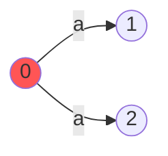

If we process the character `'a'`, what should happen? Should we go `State 1` or to `State 2`? Or should we go to both?

The answer to this question is the difference between a **Deterministic Finite State Automata (DFA)** and a **Non-Deterministic Finite State Automata (NFA)**. 

A DFA cannot have more than one transition with the same character from a single state. It requires that only a single state can be active at any time, and that once a state is processed with a character, we know deterministically in which state we will be in afterwards.

In an NFA, there is no such restriction. If there are multiple possible transitions for a given character, both states can be examined. One can imagine this as either multiple states being active on an FSM, or multiple FSMs being traversed in parallel. The result is the same.

Up until now, we have been using a DFA. Now we're going to change our model to an NFA in order to be able to process the type of FSM I've shown above.

### Changing to a NFA model

First, let's add a test which illustrates our issue.

```diff
@@ fsm_test.go

@@ func TestFSMAgainstGoRegexPkg(t *testing.T) {
                {"wildcard regex matching", "ab.", "abc"},
                {"wildcard regex not matching", "ab.", "ab"},
                {"wildcards matching newlines", "..0", "0\n0"},

                // branch
                {"branch matching 1st branch", "ab|cd", "ab"},
                {"branch matching 2nd branch", "ab|cd", "cd"},
                {"branch not matching", "ab|cd", "ac"},
+               {"branch with shared characters", "dog|dot", "dog"}, // will work
+               {"branch with shared characters", "dog|dot", "dot"}, // will not work
        }

```

So, from our tests we can see that we will find `dog`, but not `dot`. Let's take a look at our visualizer to understand why.




So, when searching for `"dog"`, we travel through the upper branch and successfully find a match. Nothing surprising here. Let's look at `"dot"`.




Ah... when matching the first `'d'` character, we go up the same branch as before. How can the program know which branch it should follow? As it can't see into the future, there are two possibilities.
1. Backtracking
2. Parallel States

Backtracking would mean travelling backwards to the route of the branch in the case of failure, then trying the next `Transition` for the `'d'` character. We can think of this as a form of **Depth First Search** as we optimistically explore the first branch, then go back in the case of failure.

Parallel States would mean going down all the possible branches simultaneously, exploring every state for which there is a valid `Transition`. You can think of this as a **Breadth First Search** of the FSM.

We're going to be exploring the second option in our program.

## Parallel States

We're introducing a large change into how our algorithm works. Instead of simply tracking a single `State`, we will now track a set of `States`. Processing a character will now mean looking at all active `States` and their valid `Transitions`, and using those as the next active `States`. We'll also need to modify our visualization code to color multiple active `States`.

As tracking the active `State` is the responsibility of the `runner`, let's start there.

```diff
@@ // runner.go

 type runner struct {
-       head    *State
-       current *State
+       head         *State
+       activeStates Set[*State]
 }
 
 func NewRunner(head *State) *runner {
        r := &runner{
-               head:    head,
-               current: head,
+               head:         head,
+               activeStates: NewSet[*State](head),
        }
 
        return r
 }

 func (r *runner) Reset() {
-       r.current = r.head
+       r.activeStates = NewSet[*State](r.head)
+}

```

We no longer want to track a single `*State`, but instead a set of `*State`. We've used a generic `Set` object here, let's define it.

```go
// set.go
  
type Set[t comparable] map[t]struct{}  
  
func NewSet[t comparable](items ...t) Set[t] {  
   set := Set[t](make(map[t]struct{}))  
   for _, item := range items {  
      set.add(item)  
   }  
   return set  
}  
  
func (s *Set[t]) add(item t) {  
   (*s)[item] = struct{}{}  
}  
  
func (s *Set[t]) remove(item t) {  
   delete(*s, item)  
}  
  
func (s *Set[t]) has(item t) bool {  
   _, ok := (*s)[item]  
   return ok  
}  
  
func (s *Set[t]) list() []t {  
   set := *s  
   list := make([]t, len(set))  
   i := 0  
   for item := range set {  
      list[i] = item  
      i++  
   }  
   return list  
}  
  
func (s *Set[t]) size() int {  
   return len(*s)  
}
```

The `Set`  type is more or less a wrapper around the `map[t]struct{}`, which should make things a bit easier.

Lots of things in `runner` should now be broken - this is normal as we've completely ripped out the underlying data structure. Our algorithm is going to change significantly. First let's look at the `Next(input rune)` method. 

As we mentioned before, we should now generate a new set of `States` by evaluating the `transitions` of the active `States`. If there are no active `States`, we should simply return.

```diff
@@ // runner.go

 func (r *runner) Next(input rune) {
-       if r.current == nil {
+       if r.activeStates.size() == 0 {
                return
        }
 
-       // move to next matching transition
-       r.current = r.current.firstMatchingTransition(input)
+       nextActiveStates := Set[*State]{}
+       for activeState := range r.activeStates {
+               for _, nextState := range activeState.matchingTransitions(input) {
+                       nextActiveStates.add(nextState)
+               }
+       }
+       r.activeStates = nextActiveStates
 }

```

One thing to notice here is that we now use a different method on the `State` type; `matchingTransitions(input rune)` instead of `firstMatchingTransition(input rune)`. This should return a list of `States` instead of a single `State`. Let's define that next.

```diff
@@ // state.go

-func (s *State) firstMatchingTransition(input rune) *State {
+func (s *State) matchingTransitions(input rune) []*State {
+       var res []*State
        for _, t := range s.transitions {
                if t.predicate.test(input) {
-                       return t.to
+                       res = append(res, t.to)
                }
        }
-
-       return nil
+       return res
 }
```

The difference here is subtle, but significant. All matching `States` are returned here, not just the first one we find.

Going back to our `runner`, we also need a new way of determining if the `runner` status. Instead of checking for a single active `State`, we need to check all of the active `States` and return if any are success `States`.

```diff
@@ // runner.go

 func (r *runner) GetStatus() Status {
-       // if the current state is nil, return Fail
-       if r.current == nil {
+       // if there are no actives states, return Fail
+       if r.activeStates.size() == 0 {
                return Fail
        }
 
-       // if the current state has no transitions from it, return Success
-       if r.current.isSuccessState() {
-               return Success
+       // if any of the active states is a success state, return Success
+       for state := range r.activeStates {
+               if state.isSuccessState() {
+                       return Success
+               }
        }
 
        // else, return normal
	    return Normal  
}
```

That should be enough to solve our current problem and bring our tests back to green!

It's useful at this point to go back and revisit our visualization tools. We no longer draw a single active state, so let's update our `drawSnapshot` function to draw each of the active `States`.

```diff
@@ // draw.go

func (r runner) drawSnapshot() string {
        graph, nodeSet := r.head.Draw()
-       switch r.GetStatus() {
-       case Normal:
-               graph += fmt.Sprintf("\nstyle %d fill:#ff5555;", nodeSet.getIndex(r.current))
-       case Success:
-               graph += fmt.Sprintf("\nstyle %d fill:#00ab41;", nodeSet.getIndex(r.current))
+       activeStates := getSortedActiveStates(r.activeStates.list(), nodeSet)
+
+       for _, state := range activeStates {
+               nodeLabel := nodeSet.getIndex(state)
+               if state.isSuccessState() {
+                       graph += fmt.Sprintf("\nstyle %d fill:#00ab41;", nodeLabel)
+               } else {
+                       graph += fmt.Sprintf("\nstyle %d fill:#ff5555;", nodeLabel)
+               }
        }
 
        return graph
 }

+func getSortedActiveStates(activeStates []*State, nodeSet OrderedSet[*State]) []*State {
+       byAscendingNodeLabel := func(i, j int) bool {
+               return nodeSet.getIndex(activeStates[i]) < nodeSet.getIndex(activeStates[j])
+       }
+       sort.Slice(activeStates, byAscendingNodeLabel)
+       return activeStates
+}

```

While not strictly necessary, it's useful to sort the `States` by their label to make it deterministic (iterating over a `map` in Go uses a random order).

With those changes, let's take a look at our previous example in our visualizer.




Look at that! We now 'split' our `State` processing and traverse all possible `States` at the same time. 

We could leave it there, but this is a nice opportunity to make an optimization. Before we carry out that optimization, let's look at one more example.

%%%%


We end up in with the right answer here because we're backtracking across every substring of the search string `"aaaab"`. This was necessary when we were an DFA, and we could only track one `State` at a time. However, now we're a NFA there's no need to backtrack and reprocess the input once we hit a failure - we can instead do the same processing in parallel.

In order to process each substring in parallel, we need to activate the starting `State` when we process each character.

Let's make a method in the `runner` to activate the first state. We'll call this `Start()` for now.

```go
// runner.go

func (r *runner) Start() {
       r.activeStates.add(r.head)
}
```

As we're going to change our algorithm, we expect that our visualizations will change also, so let's modify those tests to verify the behaviour. First, let's change our test to use the `Start` method after every character.

```diff
@@ // draw_test.go

@@ func Test_DrawSnapshot(t *testing.T) {

		for _, tt := range tests {  
		   t.Run(tt.name, func(t *testing.T) {  
		      runner := NewRunner(tt.fsmBuilder())  
		      for _, char := range tt.input {  
		         runner.Next(char)  
+		         runner.Start()  
		      }  
		      snapshot := runner.drawSnapshot()  
		  
		      if !reflect.DeepEqual(tt.expected, snapshot) {  
		         t.Fatalf("Expected drawing to be \n\"%v\"\ngot\n\"%v\"", tt.expected, snapshot)  
		      }  
		   })  
		}

```

And then let's change our test expectations so that the previous `States` are also highlighted.

```diff
@@ // draw_test.go

@@ func Test_DrawSnapshot(t *testing.T) {
    tests := []test{  
      {  
         name:       "initial snapshot",  
         fsmBuilder: abcBuilder,  
         input:      "",  
         expected: `graph LR  
0((0)) --"a"--> 1((1))  
1((1)) --"b"--> 2((2))  
2((2)) --"c"--> 3((3))  
style 3 stroke:green,stroke-width:4px;
style 0 fill:#ff5555;`,  
      },  
      {  
         name:       "after a single letter",  
         fsmBuilder: abcBuilder,  
         input:      "a",  
         expected: `graph LR  
0((0)) --"a"--> 1((1))  
1((1)) --"b"--> 2((2))  
2((2)) --"c"--> 3((3))
style 3 stroke:green,stroke-width:4px;
+style 0 fill:#ff5555;  
style 1 fill:#ff5555;`,  
      },  
      {  
-        name:  "last state highlighted",
+        name:  "all states highlighted",
         fsmBuilder: aaaBuilder,  
         input:      "aaa",  
         expected: `graph LR  
0((0)) --"a"--> 1((1))  
1((1)) --"a"--> 2((2))  
2((2)) --"a"--> 3((3))
style 3 stroke:green,stroke-width:4px;
+style 0 fill:#ff5555;  
+style 1 fill:#ff5555;  
+style 2 fill:#ff5555;  
style 3 fill:#00ab41;`,  
      },  
   }
```

All that's left to do is make changes to our `match` function of the `myRegex` type. The changes here are simple; we want to `Start` the runner again after every character is processed so that every substring is processed, and we no longer want to recursively call the function again on a substring in the case of failure.

```diff
@@ // regex.go

func match(runner *runner, input []rune, debugChan chan debugStep, offset int) bool {
        runner.Reset()
        if debugChan != nil {
               debugChan <- debugStep{runnerDrawing: runner.drawSnapshot(), currentCharacterIndex: offset}
        }
 
        for i, character := range input {
                runner.Next(character)
+               runner.Start()
                if debugChan != nil {
                       debugChan <- debugStep{runnerDrawing: runner.drawSnapshot(), currentCharacterIndex: offset + i + 1}
                }
                status := runner.GetStatus()
 
-               if status == Fail {
-                       return match(runner, input[1:], debugChan, offset+1)
-               }
-
                if status == Success {
                        return true
                }
```

With all that in place, let's try it again.


Now, all `States` are active most of the time because the initial state is being activated on every new character, meaning that each substring is being processed through the FSM. This means that no backtracking is necessary.

It looks like we're pretty close to a full implementation of the`'|'` character in regular expressions. Let's fire up our fuzzer and see if it can find what we're missing.

```diff
@@ // fsm_test.go

@@ func FuzzFSM(f *testing.F) {

        f.Add("ca(t)(s)", "dog")
 
        f.Fuzz(func(t *testing.T, regex, input string) {
-               if strings.ContainsAny(regex, "[]{}$^|*+?\\") {
+               if strings.ContainsAny(regex, "[]{}$^*+?\\") {

```

Hmm, we do see an error. 

```zsh
--- FAIL: FuzzFSM (0.00s)
	fsm_test.go:137: Mismatch - 
		Regex: '|1' (as bytes: 7c31), 
		Input: '0' (as bytes: 30) 
		-> 
		Go Regex Pkg: 'true', 
		Our regex result: 'false'

```

It seems that we return `false` when a regex is empty on one side of the `Pipe` expression, when we should return `true`. Let's see if we can see what's going on from the FSM graph for `'|1'`

Our compiled FSM looks as follows;

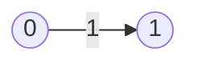

Well, that's clearly not correct. We actually need an FSM which instantly matches, because we're saying that it should match the regex `'1'` OR match the regex `''` (the empty string), which everything should match.

We're going to do this with a useful trick for handling the empty string regular expression called **epsilons**.

{} 
Check out this part of the project on GitHub [here](https://github.com/LeweyM/search/tree/master/src/v6)
{} 