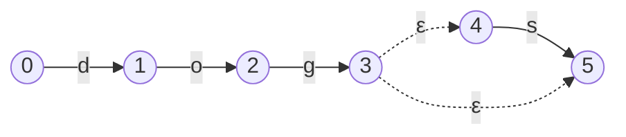
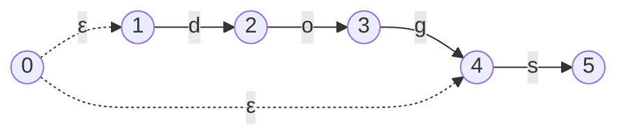
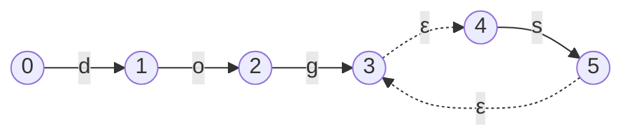
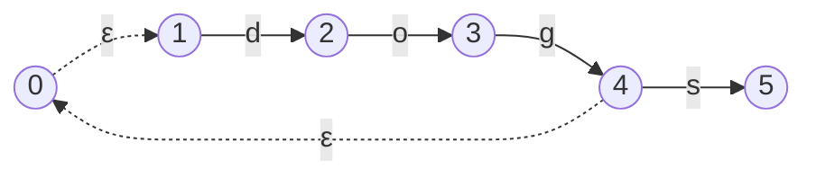
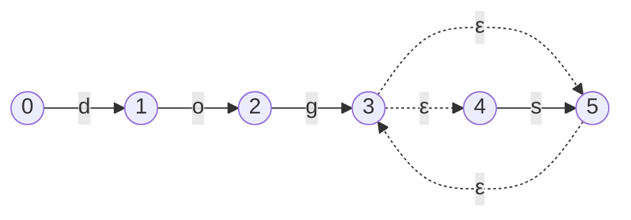
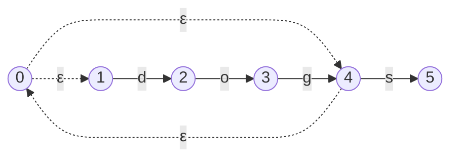
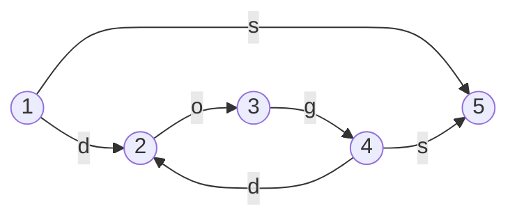

## Modifiers



Regular Expression modifiers are special characters which change how sub-expressions of the regex are interpreted. The three modifiers we'll be implementing will be the  `'?'`, `'+'`, and `'*'` modifiers.

## Expected Behavior of Modifiers

### Zero or One

The `'?'` symbol is the 'Zero or One' modifier. It says that the regex should match an expression if it appears zero or once. For example, the regular expression `ab?c` has the following match profile;
- `'abc'` → match 
- `'ac'` → match 
- `'abbc'` → no match 

Similarly, the regular expression `(abc)?z` has the profile 
- `'abcz'` → match
- `'z'` → match 
- `'abcabcz'` → no match

### One or More

The `'+'` symbol is the 'One or More' modifier. It says that the regex should match an expression if it appears one or more times. For example, the regular expression `ab+c` has the following match profile;
- `'abc'` → match 
- `'abbc'` → match 
- `'abbbc'` → match 
- `'ac'` → no match

Similarly, the regular expression `(abc)+` has the profile 
- `'abc'` → match
- `'abcabc'` → match 
- `''` → no match

### Zero or More

The `'*'` symbol is the 'Zero or More' modifier. It says that the regex should match an expression if it appears zero or more times. For example, the regular expression `ab*c` has the following match profile;
- `'abc'` → match 
- `'abbc'` → match 
- `'abbbc'` → match 
- `'ac'` → match

Similarly, the regular expression `(abc)*' has the profile 
- `'abc'` → match
- `'abcabc'` → match 
- `''` → match

## Modelling Modifiers with Epsilon FSMs

Modelling this behaviour with state machines is fairly straight forward when using epsilon transitions.

Let's start with the Zero or One modifier.

### Zero or One

Modelling the behaviour for this modifier involves implementing an optional **skip** step between the `State` (or `States`) that represent the sub expression, so that we can 'skip' over it for the 'zero' case or pass through it as normal for the 'one' case.

This should look something like this;


Let's explain this a bit.

To apply the `'?'` modifier to an FSM, we need to start from a `State` which has an epsilon transition to the start of the FSM, and also an epsilon transition to the end of the FSM.

The epsilon transition to the start of the FSM represents the 'one' case, in which we walk as normal through the FSM. 

The epsilon transition to the end of the FSM represents the 'zero' case, in which we skip the FSM entirely. 

For example, the regex `dogs?` would look like so;


And `(dog)?s` would be;



### One Or More

The One or More modifier will involve an optional **loop**. The **loop** will be used to represent the 'or More' case, and will involve looping back from the end of the sub expression back to the beginning. This can happen as many times as necessary, because the sub expression can be matches any number of times.


It should be clear that this looks very similar to the Zero Or One case.

The 'One' case is still the same, so we still need our epsilon transition pointing to the start of the FSM sub expression so that we can walk through the FSM as usual.

The **loop** for the 'Or More' case is implemented with an epsilon transition pointing from the end of the FSM back to the start[^ep]. This means that we can walk through the FSM sub expression as many times as we want without it failing.

[^ep]: Note that we can transition to the new state, or to the starting state of the FSM sub expression here, as the epsilon transition between them mean that the effect is the same.

To use the same examples as before, the regex `dogs+` would look like so;


And `(dog)+s` would be;



It might be worth stepping through these examples in your head. Although the difference in the FSM graphs is visually subtle, the effect is significant.

### Zero or More

The 'Zero or More' modifier can actually be composed of the 'One or More' and 'Zero or One' modifiers.

We need both the **skip** for the 'Zero' case, and the **loop** from the 'or More' case.


Again, the regex `dogs*` would look like so;


And `(dog)*s` would be;



Composing these FSMs with epsilons is a lot easier than without them.

## Why Epsilons?

As a quick aside, it's worth noting here that it might seem that the epsilon transitions make things more complicated rather than more simple. For example, the regex `(dog)*s` can be constructed without epsilons. Actually, all epsilon FSMs can be constructed as non-epsilon FSMs. Let's take a look at what such an FSM might look like.



This is still fairly simple, but we need to know a few things about the FSM sub expression in order to construct it, such as the transitions to and from the start and end states. The nice thing about epsilon transitions is that you can ignore the inner details of the sub expressions.

## Implementing Modifiers

Now we know the theory, let's start adding modifiers to our system.

### Parser

Let's start with our modifier data structures.

```go
// ast.go

type ZeroOrOneModifier struct {  
   Child Node  
}  
  
type OneOrMoreModifier struct {  
   Child Node  
}  
  
type ZeroOrMoreModifier struct {  
   Child Node  
}
```

And we'll add a simple `string()` method to them for debugging purposes.

```go
// ast.go

func (zo ZeroOrOneModifier) string(indentation int) string {  
   return compositeToString("ZeroOrOne", []Node{zo.Child}, indentation+1)  
}  
  
func (om OneOrMoreModifier) string(indentation int) string {  
   return compositeToString("OneOrMore", []Node{om.Child}, indentation+1)  
}  
  
func (zm ZeroOrMoreModifier) string(indentation int) string {  
   return compositeToString("ZeroOrMore", []Node{zm.Child}, indentation+1)  
}
```

As well as some a stand in `compile()` method so that the compiler doesn't complain.

```go
// ast.go
  
func (zo ZeroOrOneModifier) compile() (head *State, tail *State) {  
   panic("implement me")
}  
  
func (om OneOrMoreModifier) compile() (head *State, tail *State) {  
   panic("implement me") 
}  
  
func (zm ZeroOrMoreModifier) compile() (head *State, tail *State) {  
   panic("implement me")
}
```

Now that we have our data structures, let's set up some simple tests for the parser.

```diff
@@ // parser_test

@@ func TestParser(t *testing.T) {
+               {
+                       name:  "zero or one modifier on a character",
+                       input: "a?",
+                       expectedResult: &Group{ChildNodes: []Node{
+                               ZeroOrOneModifier{Child: CharacterLiteral{Character: 'a'}},
+                       }},
+               },
+               {
+                       name:  "zero or one modifier on a group",
+                       input: "(ab)?",
+                       expectedResult: &Group{ChildNodes: []Node{
+                               ZeroOrOneModifier{Child: &Group{ChildNodes: []Node{
+                                       CharacterLiteral{Character: 'a'},
+                                       CharacterLiteral{Character: 'b'},
+                               }}},
+                       }},
+               },
+               {
+                       name:  "one or more modifier on a character",
+                       input: "a+",
+                       expectedResult: &Group{ChildNodes: []Node{
+                               OneOrMoreModifier{Child: CharacterLiteral{Character: 'a'}},
+                       }},
+               },
+               {
+                       name:  "one or more modifier on a group",
+                       input: "(ab)+",
+                       expectedResult: &Group{ChildNodes: []Node{
+                               OneOrMoreModifier{Child: &Group{ChildNodes: []Node{
+                                       CharacterLiteral{Character: 'a'},
+                                       CharacterLiteral{Character: 'b'},
+                               }}},
+                       }},
+               }, {
+                       name:  "zero or more modifier on a character",
+                       input: "a*",
+                       expectedResult: &Group{ChildNodes: []Node{
+                               ZeroOrMoreModifier{Child: CharacterLiteral{Character: 'a'}},
+                       }},
+               },
+               {
+                       name:  "zero or more modifier on a group",
+                       input: "(ab)*",
+                       expectedResult: &Group{ChildNodes: []Node{
+                               ZeroOrMoreModifier{Child: &Group{ChildNodes: []Node{
+                                       CharacterLiteral{Character: 'a'},
+                                       CharacterLiteral{Character: 'b'},
+                               }}},
+                       }},
+               },

```

As we can see from our tests, the modifier structs act as wrappers around a single `Child` inner `Node`. 

Implementing this in our parser is fairly straight forward. We simply need to use a wrapper function, which will wrap the node if there is a modifier character present.

```diff
@@ // parser.go

@@ func (p *Parser) Parse(tokens []token) Node {
        for i, t := range p.tokens {
                switch t.symbol {
                case Character:
                        node := p.pop()
-                       node.Append(CharacterLiteral{Character: t.letter})
+                       node.Append(p.wrapWithModifier(i, CharacterLiteral{Character: t.letter}))
                        p.push(node)
                case AnyCharacter:
                        node := p.pop()
-                       node.Append(WildcardLiteral{})
+                       node.Append(p.wrapWithModifier(i, WildcardLiteral{}))
                        p.push(node)
@@				[...]
                case RParen:
                        inner := p.pop()
                        outer := p.pop()
-                       outer.Append(inner)
+                       outer.Append(p.wrapWithModifier(i, inner))
                        p.push(outer)
                }
        }
```

The wrapper function is `p.wrapWithModifier()`. let's take a look at it's implementation.

```go
// parser.go

func (p *Parser) peekAhead(i int) (bool, token) {  
   nextIndex := i + 1  
  
   if nextIndex >= len(p.tokens) {  
      return false, token{}  
   }  
  
   return true, p.tokens[nextIndex]  
}  
  
func (p *Parser) wrapWithModifier(i int, child Node) Node {  
   ok, nextToken := p.peekAhead(i)  
   if ok {  
      switch nextToken.symbol {  
      case ZeroOrOne:  
         return ZeroOrOneModifier{Child: child}  
      case OneOrMore:  
         return OneOrMoreModifier{Child: child}  
      case ZeroOrMore:  
         return ZeroOrMoreModifier{Child: child}  
      }  
   }  
  
   return child  
}
```

We use `peekAhead()` to check if there's a modifier token next, and if there is, we wrap the `Node` in the correct modifier. Otherwise, we return the `Node` as is.

Now the parser tests are passing, let's move onto the compiler.

### Compiler

Let's start with some tests;

```diff
@@ // fsm_test.go

@@ func TestFSMAgainstGoRegexPkg(t *testing.T) {
                {"word followed by group", "1(|)", "0"},
                {"empty group concatenation", "(()0)0", "0"},
                {"group followed by word", "(|)1", "0"},
+
+               // zero or one
+               {"simple zero or one with 0 '?' match", "ab?c", "ac"},
+               {"simple zero or one with one '?' matches", "ab?c", "abc"},
+               {"simple zero or one too many '?' matches", "ab?c", "abbc"},
+
+               // one or more
+               {"simple one or more with 0 '+' matches", "ab+c", "ac"},
+               {"simple one or more with one '+' matches", "ab+c", "abc"},
+               {"simple one or more with many '+' matches", "ab+c", "abbbbc"},
+
+               // zero or more
+               {"simple zero or more with 0 '*' matches", "ab*c", "ac"},
+               {"simple zero or more with one '*' matches", "ab*c", "abc"},
+               {"simple zero or more with many '*' matches", "ab*c", "abbbbc"},
        }
```

And now we simply need to implement the `compile()` methods. Let's start with `ZeroOrOneModifier`.

```go
// ast.go

func (zo ZeroOrOneModifier) compile() (head *State, tail *State) {  
   startState := &State{}  
   endState := &State{}  
  
   head, tail = zo.Child.compile()  
  
   // 'one' case, go through expression as normal  
   startState.addEpsilon(head)  
   // 'zero' case, skip to end of expression  
   startState.addEpsilon(tail)  
  
   tail.addEpsilon(endState)  
   return startState, endState  
}
```

Following our designs above, the `ZeroOrOneModifier` will create a new `State` with the name `startState`, and add an epsilon transition from `startState` to the first 'head' `State` of the compiled `Child` inner `Node`. This is for the 'one' case. 

We also need to add an epsilon transition from `StartState` to the last 'tail' `State` of the compiled `Child` inner `Node`, to represent the `zero` case where we simply 'skip' to the end.

You'll notice that we also add an extra `State` called `endState`, which we link to the 'tail' state of the compiled `Child` inner `Node`. This is not strictly necessary here, but it will ensure that our trick of saying that any `State` without outgoing transitions is a success `State` will continue to work, even if we add epsilon transitions to the last 'tail' `State`.

Let's do the same for `OneOrMoreModifier`.

```go
// ast.go

func (om OneOrMoreModifier) compile() (head *State, tail *State) {  
   startState := &State{}  
   endState := &State{}  
  
   head, tail = om.Child.compile()  
  
   // 'one' case, go through expression as normal  
   startState.addEpsilon(head)  
   // 'more' case, loop back through the expression  
   tail.addEpsilon(startState)  
  
   tail.addEpsilon(endState)  
   return startState, endState  
}
```

Here we don't need the 'zero' case, but we need a 'more' case in which we loop back from the last 'tail' `State` back to the `startState`.

And now for the `ZeroOrMoreModifier`.

```go
// ast.go

func (zm ZeroOrMoreModifier) compile() (head *State, tail *State) {  
   startState := &State{}  
   endState := &State{}  
  
   head, tail = zm.Child.compile()  
  
   // 'one' case, go through expression as normal  
   startState.addEpsilon(head)  
   // 'more' case, loop back through the expression  
   tail.addEpsilon(startState)  
   // 'zero' case, skip to end of expression  
   startState.addEpsilon(tail)  
  
   tail.addEpsilon(endState)  
   return startState, endState
```

Here we need the 'one', 'more' and 'zero' cases.

With those changes, our tests should be passing! Let's try out a few examples with our command line.

## A few examples

Let's first try with the regular expression `ca(rro)?t` using the Zero or One modifier.


We can see in this example that when matching the `(rro)` sub expression, the matcher travels along the bottom row of `States`.


When not matching the sub expression, the matcher uses the epsilons to go straight past the sub expression.

Let's try something similar with the 'One or More' modifier.


In this example, the regex `I( love)+ cats` is a good demonstration of the 'More' case looping over every match of the `( love)` sub expression.

And for one more example, let's combine the wildcard `'.'` symbol with the Zero or More `*` symbol to create a generic matcher for any substring.


Now that we can combine and compose modifiers and branches, we can create some really sophisticated regular expression matchers. Let's look at an example where we combine all of the components we've created so far.


There are a lot of moving parts here, but our composable design is keeping things in check.

Let's make sure that everything is working as expected by running our fuzzer. First, remove `*+?` from our special character filter.

```diff
@@ // fsm_test.go

@@ func FuzzFSM(f *testing.F) {
        f.Fuzz(func(t *testing.T, regex, input string) {
-               if strings.ContainsAny(regex, "[]{}$^*+?\\") {
+               if strings.ContainsAny(regex, "[]{}$^\\") {
+                       t.Skip()
+               }

```

Then, we'll also need to check for regular expressions where `?` is used on its own, as this is used for group constructions which we're not implementing in this project.

```diff
@@ // fsm_test.go

@@ func FuzzFSM(f *testing.F) {
                if strings.ContainsAny(regex, "[]{}$^\\") {
                        t.Skip()
                }
+               if strings.Contains(regex, "(?") {
+                       // '?' on its own is used for special group constructs, which we're not implementing.
                        t.Skip()
                }

```

The fuzzer should now be able to fun without finding any errors!

## What's next?

There are many more features of modern regex engines which we could implement. For example, we could allow regular expressions with `{3}` which would match exactly 3 sub expressions. Or we could allow character ranges such as `[a-zA-Z]`. We could match on expressions which start or end with an expression using `^` and `$`. 

We could also extend our matcher by returning the substring indices of the match, or by accounting for match groups. 

There's also a myriad of performance improvements we could make - our implementation is currently many, many orders of magnitude slower than the Golang implementation...

However, what I'm more interested in is converting our epsilon-based NFA to a DFA, in which every `State` has only one valid `Transition` per input.

After that, I'll probably call it a day with this project (unless something else perks my curiosity - I'm open to suggestions!).

{} 
Check out this part of the project on GitHub [here](https://github.com/LeweyM/search/tree/master/src/v9)
{} 