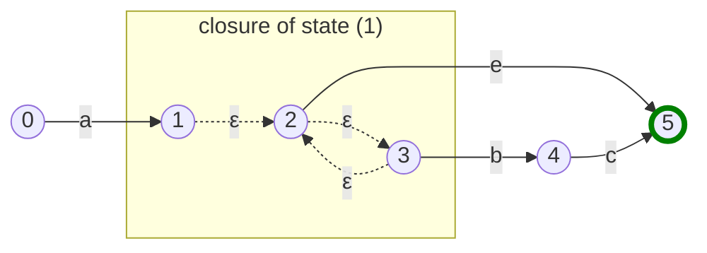
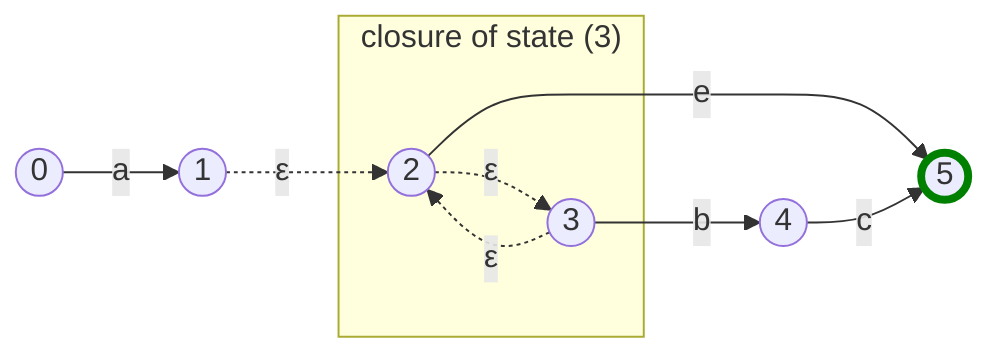
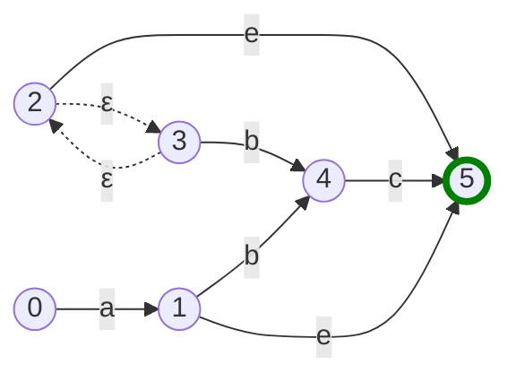
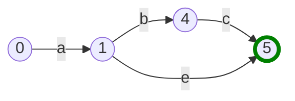
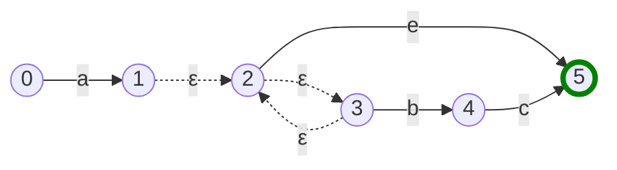

## Reducing Epsilon NFA to NFA

Having spent so long building up state machines using epsilon transitions, it now seems slightly perverse that we're going to spend this chapter ripping them out! However, we're still going to use them to compose our regular expression FSMs. The idea is to compose using epsilons, because it's easier, and then **reduce** the epsilon-NFA to a normal NFA.

The benefits of doing so are mainly for performance, although we haven't been particularly performance conscious up until now, and there are plenty of optimisations we could make before this one. The performance benefits come from not having to traverse the set of states connected by epsilons. One way of thinking of this optimisation is that we cache those set of states so that they don't have to be traversed every time.

## Some preparatory code changes

Before we get stuck in, there are a few changes we have to make to our code.

First, it's finally time to give up our hack of using the last state as the success state. The technique we're going to use means that this is not true in all cases, so we need a way of keeping track of which states should be considered success states. 

The simplest way I can think of is a flag on the `State` struct for this.

```diff
@@ // state.go

 type State struct {
        transitions []Transition
        epsilons    []*State
+       success     bool
 }
```

This simplifies our `isSuccessState() bool` method, as we no longer need to check its transitions.

```diff
@@ // state.go

 func (s *State) isSuccessState() bool {
-       if len(s.transitions) == 0 && len(s.epsilons) == 0 {
-               return true
-       }
-
-       return false
+       return s.success
 }
```

And now we just need a simple method to turn a state into a success state.

```go
// state.go

func (s *State) SetSuccess() {
    s.success = true
}
```

Now let's use our new setter method. We'll need it in our `myRegex` struct, and also in our `draw_test` methods.

```diff
@@ // regex.go

func NewMyRegex(re string) *myRegex {
        tokens := lex(re)
        parser := NewParser(tokens)
        ast := parser.Parse()
        state, _ := ast.compile()
+       endState.SetSuccess()

        return &myRegex{fsm: state}
 }
```

```diff
@@ // draw_test.go

func abcBuilder() *State {
        state1.addTransition(state2, Predicate{allowedChars: "a"}, "a")
        state2.addTransition(state3, Predicate{allowedChars: "b"}, "b")
        state3.addTransition(state4, Predicate{allowedChars: "c"}, "c")
+       state4.SetSuccess()
        return state1
 }

func aaaBuilder() *State {
        state1.addTransition(state2, Predicate{allowedChars: "a"}, "a")
        state2.addTransition(state3, Predicate{allowedChars: "a"}, "a")
        state3.addTransition(state4, Predicate{allowedChars: "a"}, "a")
+       state4.SetSuccess()
        return state1
 }

func aεbBuilder() *State {
        state1.addTransition(state2, Predicate{allowedChars: "a"}, "a")
        state2.addEpsilon(state3)
        state3.addTransition(state4, Predicate{allowedChars: "b"}, "b")
+       state4.SetSuccess()
        return state1
 }
```

Lovely, everything should be green again!

## Adding flags to our command line tool

We want the ability to apply flag arguments to our commands. Flag arguments are prefixed with `--` and they can be used in any order. This is unlike arguments we've used until now, which have a fixed order. For example, in the command `draw "abc" "a"`, the arguments `draw`, `"abc"`, and `"a"` are all defined by their order. We could also describe the command as `{command} {regex} {search-string}`.[^posargs]
[^posargs]: Command line arguments which depend on the order are known as **positional arguments**.

Let's add a data structure for flags.

```go
// main.go

type CmdFlag string
```

This should be enough for now. We just need a set of `CmdFlags`, which are a special type built on top of simple `strings`. The only flag we'll need now is the one which enabled epsilon reduction, so let's add that.

```go
// main.go

const reduceEpsilon CmdFlag = "reduce-epsilon"
```

Now let's add these to our main function.

```diff
@@ // main.go

 // Main just used for linking up the main functions
 func Main(args []string) {
+       args, flags := parseArgumentsAndFlags(args)
+
        switch args[0] {
        case "draw":
                if len(args) == 2 {
-                       RenderFSM(args[1])
+                       RenderFSM(args[1], flags)
                } else if len(args) == 3 {
-                       RenderRunner(args[1], args[2])
+                       RenderRunner(args[1], args[2], flags)
                }
        case "out":
                if len(args) == 4 {
-                       OutputRunnerToFile(args[1], args[2], args[3])
+                       OutputRunnerToFile(args[1], args[2], args[3], flags)
                }
        default:
                panic("command not recognized")
		}
 }

 // RenderFSM will render just the finite state machine, and output the result to the browser
-func RenderFSM(input string) {
+func RenderFSM(input string, flags Set[CmdFlag]) {
        graph := NewMyRegex(input).DebugFSM()
        html := buildFsmHtml(graph)
        outputToBrowser(html)
 }

 // RenderRunner will render every step of the runner until it fails or succeeds. The template will then take care
 // of hiding all but one of the steps to give the illusion of stepping through the input characters. It will
 // then output the result to the browser.
-func RenderRunner(regex, input string) {
+func RenderRunner(regex, input string, flags Set[CmdFlag]) {
        htmlRunner := buildRunnerHTML(data)
        outputToBrowser(htmlRunner)
 }

 // OutputRunnerToFile will render every step of the runner, the same as RenderRunner, and then write the html to
 // a file.
-func OutputRunnerToFile(regex, input, filePath string) {
+func OutputRunnerToFile(regex, input, filePath string, flags Set[CmdFlag]) {
        data := buildRunnerTemplateData(regex, input)
        htmlRunner := buildRunnerHTML(data)
        outputToFile(htmlRunner, filePath)
 }
```

Here, we're simply passing the `flags` variable, which is of type `Set[CmdFlag]`, to our three output functions, `RenderFSM`, `RenderRunner`, and `OutputRunnerToFile`. Currently, we do nothing with it (we'll fix that later). 

The `flags` variable comes from the `parseArgumentsAndFlags(args)` method. Let's implement that now.

```go
// main.go

func parseArgumentsAndFlags(args []string) ([]string, Set[CmdFlag]) {  
   flagSet := NewSet[CmdFlag]()  
   var arguments = []string{}  
   for _, arg := range args {  
      switch arg {  
      case "--reduce-epsilons":  
         flagSet.add(reduceEpsilon)  
      default:  
         if strings.HasPrefix(arg, "--") {  
            panic(fmt.Sprintf("flag '%s' not recognized", arg))  
         }  
         arguments = append(arguments, arg)  
      }  
   }  
   return arguments, flagSet  
}
```

This is simple enough. We add any flag arguments to our `flagSet`, other arguments are appended to the list of normal arguments, and if we receive any `--` flags which we don't recognise, we panic. This is where we'll add any other flags we want to introduce to our system.

Now we're ready to add to start reducing.

## Reducers

We're going to add a new concept to our program; a **Reducer**. A Reducer is an object which takes an FSM and modifies it. The modified FSM will have been reduced in some way which is opaque to the outside - our components will know how to use a reducer, but not how it works.

We can implement this as an interface. [^packages]
[^packages]: In Go, unlike most languages which use interfaces, the interface is defined by the consumer, rather than the implementer. Because of this, I've chosen to define this interface in the `regex.go` file. In the project repository, all of the examples are defined in the same package, so only one definition of the interface is required. If we were spreading our program across different packages, as most Go projects do, we would write this interface everywhere that it is consumed. Although this seems like unnecessary repetition, it's actually very useful, as it allows the consumer to only define the parts of the required object necessary to carry out its specific task. If the interface were centrally defined by the implementer, the consumer would be obliged to know everything about the whole interface.  

```go
// regex.go

type Reducer interface {  
   reduce(s *State)  
}

```

We now simply have to apply one or more Reducer to our FSM.

```diff
@@ // regex.go

-func NewMyRegex(re string) *myRegex {
+func NewMyRegex(re string, reducers ...Reducer) *myRegex {
        tokens := lex(re)
        parser := NewParser(tokens)
        ast := parser.Parse()
+       state, endState := ast.compile()
+       for _, reducer := range reducers {
+               reducer.reduce(state)
+       }
+
        return &myRegex{fsm: state}
 }
```

Using this patterns means that we can easily add more reducers to our system. 

Let's go ahead and define our first reducer, the epsilon-reducer.

## The Epsilon Reducer

First, our data structure.

```go
// epsilon-reducer.go

// epsilonReducer will turn an epsilon-NFA into an NFA. It does this by collecting the transitions
// of all the states in a given state's epsilon closure (the set of states connected by epsilons)  
// and applying those to state.  
type epsilonReducer struct{}

func (e *epsilonReducer) reduce(s *State) {
	// todo: implement me
    return
}
```

We'll also add a stand-in `reduce()` function just to appease the compiler.

Before we get into how this works, let's modify our tests to include this reducer.

```diff
@@ // fsm_test.go

@@ func TestFSMAgainstGoRegexPkg(t *testing.T) {
        for _, tt := range tests {
-               t.Run(tt.name, func(t *testing.T) {
+               t.Run(fmt.Sprintf("without reducers - %s", tt.name), func(t *testing.T) {
                        compareWithGoStdLib(t, NewMyRegex(tt.regex), tt.regex, tt.input)
                })
        }
+
+       for _, tt := range tests {
+               t.Run(fmt.Sprintf("with epsilon reducer - %s", tt.name), func(t *testing.T) {
+                       compareWithGoStdLib(t, NewMyRegex(tt.regex, &epsilonReducer{}), tt.regex, tt.input)
+               })
+       }
 }

@@ func FuzzFSM(f *testing.F) {
                if err != nil {
                        t.Skip()
                }
-               compareWithGoStdLib(t, NewMyRegex(regex), regex, input)
+               compareWithGoStdLib(t, NewMyRegex(regex, &epsilonReducer{}), regex, input)
        })
 }
```


{}
It's worth noting here that these tests only check that the result of the regex match is correct, not that the FSM has been correctly reduced.
{} 

And let's also change our CLI commands to make use of this reducer.

```diff
@@ // main.go

-func RenderFSM(input string) {
-       graph := NewMyRegex(input).DebugFSM()
+func RenderFSM(input string, flags Set[CmdFlag]) {
+       reducers := getReducersFromFlags(flags)
+       graph := NewMyRegex(input, reducers...).DebugFSM()
        html := buildFsmHtml(graph)
        outputToBrowser(html)
 }
 
@@ func RenderRunner(regex, input string, flags Set[CmdFlag]) {
+       data := buildRunnerTemplateData(regex, input, getReducersFromFlags(flags))
        htmlRunner := buildRunnerHTML(data)
        outputToBrowser(htmlRunner)
 }

@@ func OutputRunnerToFile(regex, input, filePath string, flags Set[CmdFlag])
 {
+       data := buildRunnerTemplateData(regex, input, getReducersFromFlags(flags))
        htmlRunner := buildRunnerHTML(data)
        outputToFile(htmlRunner, filePath)
 }

-func buildRunnerTemplateData(regex string, input string) TemplateData {
-       newMyRegex := NewMyRegex(regex)
+func buildRunnerTemplateData(regex string, input string, reducers []Reduce
r) TemplateData {
+       newMyRegex := NewMyRegex(regex, reducers...)
        debugSteps := newMyRegex.DebugMatch(input)
```

And let's also add our helper method to extract reducers from our set of flags.

```go
// main.go

func getReducersFromFlags(flags Set[CmdFlag]) []Reducer {  
   var reducers []Reducer  
  
   for flag := range flags {  
      switch flag {  
      case reduceEpsilon:  
         reducers = append(reducers, &epsilonReducer{})  
      }  
   }  
   return reducers  
}
```

Now, let's look at how it works.

## The Epsilon Reduction Algorithm

When a state is connected to other states via an epsilon transition, we call this set of states the **epsilon closure of the state**. When we transition to a state within an epsilon closure, it's as though we transition to every state within the closure. 

As an example, this is a visualisation of the epsilon closure of state 1. In this system, the closure of state 1 is `{1, 2, 3}`, that is, states 1, 2 and 3.


Notice that the closure of state 2 and 3 would be different, because state 1 cannot be reached from those states. Therefore, the closure of state 2 and 3 is `{2, 3}`.




The key to reducing epsilon transitions is by treating all the states in an epsilon closure as a single state. This means collecting all the transitions of each state in the closure and creating a new state that contains all of those transitions. It also means that if any of the states in the closure are a success state, the new state should be a success state also.

The algorithm for reducing the epsilons of a state is as follows:
1. Collect the states of the epsilon closure.
2. Collect the transitions of all states within the closure.
3. Remove any epsilon transitions from the state.
4. Replace the transitions of the state with the closure transitions.
5. If any state in the closure is a success state, make the state a success state.
6. Recur on connected states.

In the previous example, reducing the epsilons of state 1 would mean collecting the transitions of all the states in the closure of state 1, which is `{1, 2, 3}`. There are two transitions in that closure: 
 1. `(2) --e--> (5)` 
 2. `(3) --b--> (4)`

So, we just need to replace the transitions of state 1 with the transitions:

 1. `(1) --e--> (5)` 
 2. `(1) --b--> (4)`


This can be further simplified, because states 2 and 3 are not reachable from our starting state, so they can be ignored.


{} 
According to the last step in our algorithm, we now recur on the connected states, which are states 4 and 5. Because they have no epsilon transitions, we can consider their epsilon closures to be a set of 1, their own state. These would be `{4}` and `{5}` respectively. As a result, the reduction would have no effect. We do, however, have to be careful that we haven't already visited this state during the reduction, otherwise we could enter into an infinite loop if there are circular dependencies in our node graph.
{} 

If you compare this to our original FSM, you'll find they are functionally identical! It's worth stepping through them in your head a few times to convince yourself of this.



Now that we understand the theory, let's start coding.

## Implementing the Algorithm

First, we'll need a way to gather the epsilon closure of a state. Let's add this as a method of the `State` struct.

```go
// state.go

func (s *State) getEpsilonClosure() Set[*State] {  
   set := NewSet[*State](s)  
  
   s.traverseEpsilons(set)  
  
   return set  
}  
  
func (s *State) traverseEpsilons(states Set[*State]) {  
   for _, state := range s.epsilons {  
      if !states.has(state) {  
         states.add(state)  
         state.traverseEpsilons(states)  
      }  
   }  
}
```

Here, we're using our `Set` data structure to represent an epsilon closure as a `Set[*State]`. The traversal is very similar to how we've previously done it, so I won't go into more details here.

Now, let's code up the algorithm in the `epsilonReducer.reduce()` method.

```go
// epsilon-reducer.go

func (e *epsilonReducer) reduce(s *State) {
    states := NewSet[*State]()
    e.reduceEpsilons(s, &states)
}

func (e *epsilonReducer) reduceEpsilons(s *State, visited *Set[*State]) {
    // 0. if this state has already been reduced, return to avoid infinite recursive loops.
    if visited.has(s) {
        return
    }
    visited.add(s)

    // 1. Collect the states of the epsilon closure.
    closure := s.getEpsilonClosure()

    // 2. Collect the transitions of all states within the closure.
    closureTransitions := collectTransitions(closure)

    // 3. Remove any epsilon transitions from the state.
    s.epsilons = nil

    // 4. Replace the transitions of the state with the closure transitions.
    s.transitions = nil
    for _, t := range closureTransitions {
        s.addTransition(t.to, t.predicate, t.debugSymbol)
    }

    // 5.  If any state in the closure is a success state, make the state a success state.
    for state := range closure {
        if state.isSuccessState() {
            s.SetSuccess()
            break
        }
    }

    // 6. Recur on connected states.
    for _, transition := range s.transitions {
        e.reduceEpsilons(transition.to, visited)
    }
}

func collectTransitions(states Set[*State]) []Transition {
    var transitions []Transition
    for state := range states {
        transitions = append(transitions, state.transitions...)
    }
    return transitions
}
```

As we've already explained the algorithm, the implementation is actually quite straight forward. The only clarification I'll make is for step 0, which is a simple check that we haven't already visited this state in order to prevent any infinite loops.

Now that that's working, let's try it out!

## A few examples

First, let's see an example without epsilon reduction.



And then let's compare it to with the epsilon reduction.



{} 
Check out this part of the project on GitHub [here](https://github.com/LeweyM/search/tree/master/src/v10)
{} 